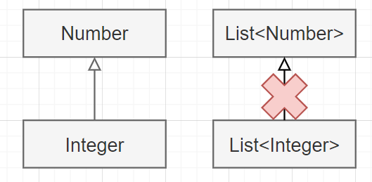
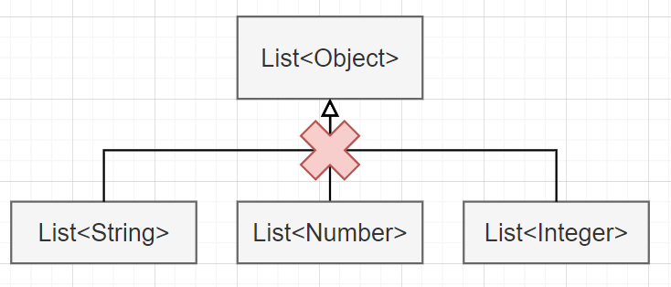
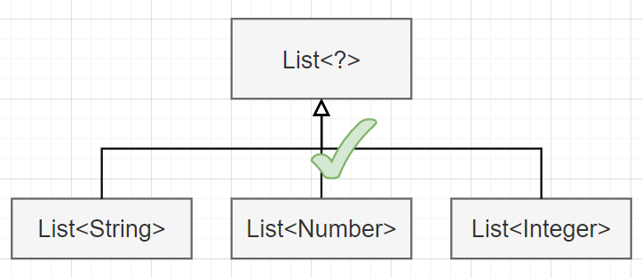

# Java 泛型

## Why?

1. Stronger type checks at compile time instead of runtime.（类型安全检查提前到编译期）
2. Elimination of casts.（无需类型强转）
3. Enabling programmers to implement generic algorithms.（使用泛型能写出更加灵活通用的代码）


## Basic Concepts

### Wildcards Inheritance

`List<Number>` is not the supertype of `List<Integer>`:



Likewise, `List<Object>` is not the supertype of `List<E>` of any `E`:



`List<?>` is the supertype of all generic `List<E>`:




### Wildcards PECS principle

* Wildcard PECS (Producer Extends Consumer Super) 原则，即频繁往外读取内容的，适合用 <? extends T>；经常往里添加或插入的，适合用 <? super T>
* PECS准测示例：

```java
/* Producer Extends */
public <T> void readElem(List<? extends T> list, T shape) {
    T readElem = list.get(0);
}
// invocation
List<ColoredCircle> list;
Circle circle;
readElem(list, circle);	// inside method: Circle readOutElem = ColoredCircle firstElemOfList;

// another invocation
List<UncoloredCircle> list2;
Circle circle;
readElem(list2, circle);	// inside method: Circle readOutElem = UncoloredCircle firstElemOfList;
```

```java
/* Consumer Super */
public <T> void addElem(List<? super T> list, T shape) {
    list.add(shape);
}
// invocation
List<Shape> list;
Circle circle;
addElem(list, circle);	// inside method: Shape addInElem = Circle passedInParam;

// another invocation
List<Shape> list;
Square square;
addElem(list, square);	// inside method: Shape addInElem = Square passedInParam;
```

深入想一下PECS的原因，本质上就是**多态 —— 父类的引用可以指向子类的对象**。对于生产者，需要用 `T` 类型引用 `? extends T` 类型；对于消费者，需要用 `? super T` 类型引用 `T` 类型。

* 对于 “Producer Extends” 的例子，list 用于 “生产元素”（也即从list里读出数据），需要作为父类对象 `shape` 引用来指向子类对象 `list.get(0)`。采用 `List<? extends T>` 就可以更加泛化 `readElem` 方法的使用范围，`List<ColoredCircle>` 和 `List<UncoloredCircle>` 都可以作为方法实参。
* 对于 “Consumer Super” 的例子，list 用于 “消费元素”（也即向list里写入数据），需要作为父类对象 `addInElem` 引用来指向子类对象 `circle`。采用 `List<? super T>` 就可以更加泛化 `addElem` 方法的使用范围，`Circle` 和 `Square` 都可以作为方法实参。


### Unbounded Wildcard `List<?>` vs. Raw type `List`

```java
// List<?> (list of unknown type)
List<?> list = new ArrayList<String>();
list.add("aString"); 	//does not compile - we don't know it is a List<String>
list.add(10);			//does not compile - we don't know it is a List<Integer>
list.add(null); 		//this is fine - List<?> can only add null elements
list.clear(); 			//this is fine, clear() does not depend on the generic parameter type

// List (list of any type)
List list = new ArrayList<String>();
list.add("aString");	// ok
list.add(10);			// ok
```

So if `List<?>` can only add `null`s, what can it do (it seems useless...)? （答案：实际上 `List<?>` 的作用在于作为**方法形参**，它相比 raw type `List` 的区别在于，`List<?>` 限制了其**只能装载某一种类型的元素**，而 `List<?>` 可以**装载各种类型的元素**。单独创建一个 `List<?>` 类型的变量是没有任何意义的，因为里面只能装 `null`），具体见下。

如使用 `List<Object>` 作为参数，则无法传入 `List<String>`, `List<Integer>` 等：

```java
public static void printList(List<Object> list) {
    for (Object elem : list)
        System.out.println(elem + " ");
    System.out.println();
}

// NOT working:
List<String> list;
printList(list);
```

But now it works:

```java
public static void printList(List<?> list) {
    for (Object elem: list)
        System.out.print(elem + " ");
    System.out.println();
}
```


### Unbounded Wildcard `List<?>` vs. `List<Object>`

作为方法参数时，二者有本质区别：

* `List<?>` 作为方法参数的话，实参可以是任意List，如 `List<Object>`, `List<String>` , `List<Number>` 
* `List<Object>` 作为方法参数的话，实参可以只能是 `List<Object>`


### Bounded Wildcard vs. Bounded Type Parameter (TODO)

> Ref: bounded wildcards vs. bounded type parameter: https://stackoverflow.com/questions/3486689/java-bounded-wildcards-or-bounded-type-parameter

分析以下两个方法：

```java
// Bounded Wildcard
public <T> void addToList(List<? extends Shape> shapes, T shape) {
    // shapes.add(shape); 	// compile error（因为编译器无法确定 shapes存储的元素类型为T）
}

// 也即可能会有如下调用:
// addToList(new ArrayList<Square>(), new Circle());
```

而使用 Bounded Type Parameter 则无问题:

```java
// Bounded Type Parameter
public <T extends Shape> void addToList(List<T> shapes, T shape) {
    shapes.add(shape);
}
// 此时如有如下调用，编译器会报错
// addToList(new ArrayList<Square>(), new Circle());
addToList(new ArrayList<Shape>(), new Circle());
```

其实可以理解为：bounded wildcard 只对**方法传参本身**进行编译时检验和限制，bounded type parameter 则会把**方法传参**和**方法体内的逻辑**通过 `T` 进行关联和限制。


### Under the hood

(泛型是如何编译的？`List<String>` 和 `List<Integer>` 是否编译为两个文件？)

* 泛型擦除：https://www.cnblogs.com/hongdada/p/13993251.html


## 总结 -- 各种泛型的使用场景

1. **Raw type**：不要使用（因为 raw type 存在的意义仅仅是兼容没有引入泛型时 JDK 1.5 之前的老旧代码，新写的代码都不应该使用 raw type ---*Effective Java Item23* ）

    > Ref: https://docs.oracle.com/javase/tutorial/java/generics/rawTypes.html

    

2. **Bounded Type Parameters**：用于限制泛型方法（generic method）的入参类型，这样就能在方法中调用具体类型的方法来实现逻辑功能。

    | \<T\>                                            | \<T extends Number\>                                 |
    | ------------------------------------------------ | ---------------------------------------------------- |
    | 方法入参类型的范围大（可以是任意类型）           | 方法入参类型的范围小（只能是Number类型及其子类）     |
    | 方法内只能调用对象继承（或覆盖）的 Object 类方法 | 方法内可以调用对象继承（或覆盖）的所有 Number 类方法 |

    如果要单独限制某个方法：

    ```java
    public class NumberUtil {
        public static <T extends Number> boolean isEven(T num) {
            return num.intValue() % 2 == 0;		// 可以调用Number类的方法。如果不加<T extends Number>则无法调用 
        }
        
        public static <T> boolean isEven(T num) {
            return num.intValue() % 2 == 0;		// 编译失败，只能适用Object的方法
        }
    }
    ```

    如果要使限制作用于整个类，则可以在类名后标注：

    ```java
    public class NaturalNumber<T extends Number> {
    
        private T num;
    
        public NaturalNumber(T num)  { this.num = num; }
    
        public boolean isEven() {
            return num.intValue() % 2 == 0;	// 可以调用Number类的方法。如果不加<T extends Number>则无法调用 
        }
    }
    ```

    > Ref: https://docs.oracle.com/javase/tutorial/java/generics/boundedTypeParams.html

3. **Upper Bounded Wildcard**：

4. **Lower Bounded Wildcard**：

5. **Unbounded Wildcard**：

    - If you are writing a method that can be implemented using functionality provided in the `Object` class.
    - When the code is using methods in the generic class that don't depend on the type parameter. For example, `List.size` or `List.clear`. In fact, `Class<?>` is so often used because most of the methods in `Class<T>` do not depend on `T`.