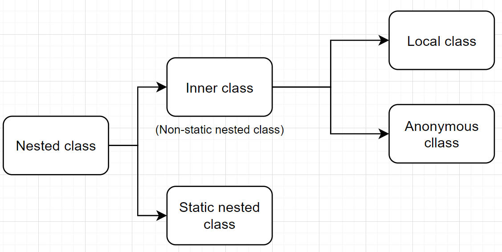
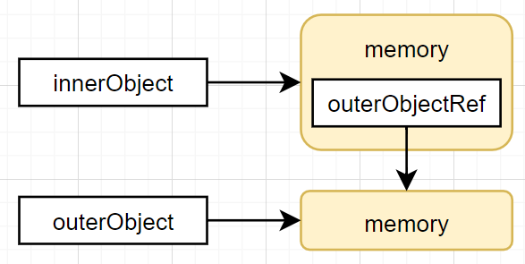

# Nested Class




### Why use nested classes?

* **It is a way of logically grouping classes that are only used in one place**
* **It increases encapsulation**: 
  * By hiding class B within class A, A's members can be declared `private` and B can access them. If nested class is not used, this member must at least be declared as package-private (`default`) and may be accessed by other classes in the same package. In short, nested class provides an access privilege between `private` and `default`.
  * In addition, B itself can be hidden from the outside world.
* **It can lead to more readable and maintainable code** (e.g. anonymous class)


### How is nested class created and stored in JVM?

* Nested class will be compiled into a separate `.class` file other than its outer class
* Compiler automatically adds a reference to the outer class as a field of the nested class
* Compiler automatically also adds a reference to the outer class as a parameter of the nested class constructor



### Inner class

Inner class object must be created after creating an outer class object:

```java
OuterClass outerObject = new OuterClass();
OuterClass.InnerClass innerObject = outerObject.new InnerClass();
```


### Local & Anonymous class

* ***Local classes*** are defined in a block of code (method, loop, if-clause). But they are usually **inside a method**.

* ***Anonymous classes*** are local classes without names.

```Java
public class Main {
  
    interface HelloWorld {
        public void greet();
        public void greetSomeone(String someone);
    }
  
    public void sayHello() {
        
        // 1.This is a local class
        class EnglishGreeting implements HelloWorld {
            String name = "world";
            public void greet() {
                greetSomeone("world");
            }
            public void greetSomeone(String someone) {
                name = someone;
                System.out.println("Hello " + name);
            }
        }
      
        HelloWorld englishGreeting = new EnglishGreeting();
        
        // 2.This is an anonymous class
        HelloWorld frenchGreeting = new HelloWorld() {
            String name = "tout le monde";
            public void greet() {
                greetSomeone("tout le monde");
            }
            public void greetSomeone(String someone) {
                name = someone;
                System.out.println("Salut " + name);
            }
        };
        
        // 2.This is also an anonymous class
        HelloWorld spanishGreeting = new HelloWorld() {
            String name = "mundo";
            public void greet() {
                greetSomeone("mundo");
            }
            public void greetSomeone(String someone) {
                name = someone;
                System.out.println("Hola, " + name);
            }
        };
        englishGreeting.greet();
        frenchGreeting.greetSomeone("Fred");
        spanishGreeting.greet();
    }

    public static void main(String... args) {
        Main myApp = new Main();
        myApp.sayHello();
    }            
}
```


### Memory leak problem


Nested class with `finalize()` method override, to show when it is garbage collected:
```java
public class OuterClass {

    @Override
    protected void finalize() {
        System.out.println("Outer is garbage collected");
    }

    class InnerClass {
        @Override
        protected void finalize() {
            System.out.println("Inner is garbage collected");
        }
    }
}
```

This is a POJO class for comparison:
```java
public class PlainClass {

    @Override
    protected void finalize() throws Throwable {
        super.finalize();
        System.out.println("Plain is garbage collected");
    }
}
```


Main method execution:

```java
import java.lang.Thread;

public class Main {

    public static void main(String[] args) throws InterruptedException {
        OuterClass outerObject = new OuterClass();
        OuterClass.InnerClass innerObject = outerObject.new InnerClass();
        PlainClass plainObject = new PlainClass();

        // Remove strong reference
        outerObject = null;
        plainObject = null;

        // outerObject cannot be GC, since innerObject still holds a strong ref to outerObject
        System.out.println("=== Execute GC ===");
        System.gc();    
        Thread.sleep(1000);

        // Remove strong reference
        innerObject = null;

        // now outerObject can be GC
        System.out.println("=== Execute GC (after removing inner class object strong reference) ===");
        System.gc();
        Thread.sleep(1000);

        System.out.println("End of program.");
    }
}
```

Output:

```tex
=== Execute GC ===
Plain is garbage collected
=== Execute GC (after removing inner class object strong reference) ===
Inner is garbage collected
Outer is garbage collected
End of program.
```

Conclusion: class `Main` 