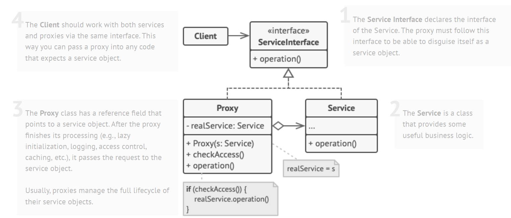

# Dynamic Proxy

Reflection is used for quite some purposes. One of them is dynamic proxy.


* 引入：代理设计模式（也即静态代理）
* 方式一：JDK Proxy
* 方式二：CGLIB
* example: AOP


> Ref: 
>
> * [java反射在项目中的使用场景_项目中 一般反射的应用-CSDN博客](https://blog.csdn.net/m0_68705273/article/details/131006947)
> * annotation: [OOP Metaprogramming Series: Java Reflection and AOP | by mvndy | Medium](https://hinchman-amanda.medium.com/oop-metaprogramming-series-java-reflection-and-aop-6f63b23f0b05)
> * 动态代理：[什么是动态代理?两种常用的动态代理方式-CSDN博客](https://blog.csdn.net/qq_16570607/article/details/118360338)


### Intro: Proxy pattern (static proxy)




The purpose of `ServiceInterface` makes proxy and service objects interchangeable in code (so that where `Service` is used, can be substituted by `Proxy`). 

Proxy pattern use case:

* Where you want to add code before/after the execution
* Lazy initialization (virtual proxy)
* Access control (protection proxy)
* Local execution of a remote service (remote proxy)
* Logging requests (logging proxy)
* Caching request results (caching proxy)


### So what is Dynamic Proxy?

Static proxy (proxy pattern) creates the proxy during **compilation**. Dynamic proxy creates the proxy during **runtime**.


### JDK Proxy

Because already extended Proxy, JDK Proxy can only use interface:

```java
$Proxy0 extends Proxy implements Person
```


Code example:

```java
public interface PrintInterFace {
    public void print();
}
```

```java
public class PrintClass implements PrintInterFace{

    @Override
    public void print() {
        try {
            System.out.println("Hi! Waiting in queue...");
            Thread.sleep(1000);
            System.out.println("Print started!");
            Thread.sleep(500);
            System.out.println("Print done!");
        } catch (InterruptedException e) {
            throw new RuntimeException(e);
        }
    }
}
```

Using JDK `Proxy`:

```java
public class Main {

    public static void main(String[] args) throws InterruptedException {

//        System.getProperties().put("sun.misc.ProxyGenerator.saveGeneratedFiles", "true");

        PrintClass printObj = new PrintClass();

        Object printerProxy = Proxy.newProxyInstance(
                printObj.getClass().getClassLoader(),
                printObj.getClass().getInterfaces(),
                new InvocationHandler() {
                    @Override
                    public Object invoke(Object proxy, Method method, Object[] args) throws Throwable {
                        long startTime = System.currentTimeMillis();
                        Object result = method.invoke(printObj, args);
                        long endTime = System.currentTimeMillis();
                        System.out.println("Method " + method.getName() + " invocation took " + (endTime - startTime) + " ms");
                        return result;
                    }
                }
        );

        ((PrintInterFace) printerProxy).print();
    }
}
```


### CGLIB Proxy


 

### Compare

JDK 动态代理：通过接口

CGLIB 动态代理：通过类


### Dynamic proxy in Spring


### Spring @Configuration

在使用 Spring 的时候我们可以通过如下方式定义 Bean：

```java
@Configuration
@ComponentScan(basePackageClasses = Company.class)
public class Config {
  @Bean
  public Address getAddress() {
    return new Address("High Street", 1000);
  }

  @Bean
  public Person getPerson() {
    return new Person(getAddress());
  }
}
```

当初对于这种方式的一种困惑就是，Spring 是怎么拦截对 `getAddress` 方法的调用的，因为在我的印象中 JDK 动态代理做不到这样的事情，现在才发现，Spring 会通过 CGLIB 为 **`Config` 创建代理对象，拦截对 `getAddress` 方法的调用，保证 Bean 的单例性**。


> Ref: [Java 动态代理的简单使用和理解 (rgb-24bit.github.io)](https://rgb-24bit.github.io/blog/2020/java-dynamic-proxy.html#orge888cf0)