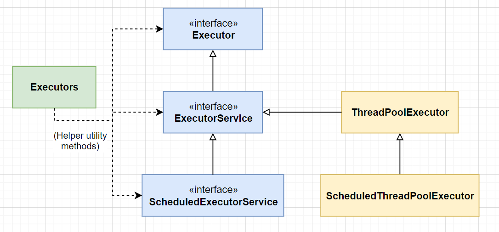
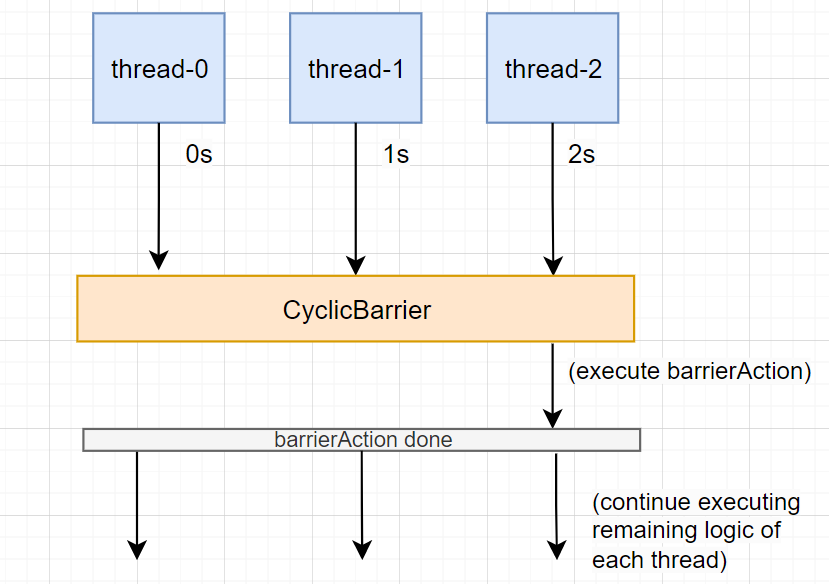

# `java.util.concurrent` 包概述

对于Java并发相关的工具而言，无非两大类：

1. 如何**执行**多线程任务（`Executor`, `ThreadPoolExecutor`, `Future`, ...）
2. 如何保证多线程安全，实现多线程任务之间的**同步**（`CountDownLatch`, `CyclicBarrier`, ...）

这是 `java.util.concurrent` 包中提供的两大功能。除此之外，该包也提供了现成的**线程安全集合类**（如 `ConcurrentHashMap` 等）。以上三点共同组成了 `java.util.concurrent` 包。


## 多线程任务的执行和管理 - `Executor`

`Executor` 是 `java.util.concurrent` 包中的一个接口。


### 什么是 Executor？

> [`Executor`](https://docs.oracle.com/javase/8/docs/api/java/util/concurrent/Executor.html) is a simple standardized interface for defining custom thread-like subsystems, including thread pools, asynchronous I/O, and lightweight task frameworks. Depending on which concrete Executor class is being used, tasks may execute in a newly created thread, an existing task-execution thread, or the thread calling [`execute`](https://docs.oracle.com/javase/8/docs/api/java/util/concurrent/Executor.html#execute-java.lang.Runnable-), and may execute sequentially or concurrently.

从上面的描述（来自Java doc）看，Executor 是一个**任务执行框架**，可以接收和执行任务。它的接口方法是 `execute(Runnable r)`，具体的任务即是 `Runnable r`，而 `Executor` 负责执行这个任务。


具体的实现是多样化且可高度自定义的，可以是同步或异步的，也可以使用单一线程或使用线程池。比如下面就是一个简单自定义的**同步** Executor，在主线程中直接阻塞式运行，不会创建新的线程：

```java
class SimpleSyncExecutor implements Executor {
    @Override
    public void execute(Runnable r) {
        r.run();
    }
}

// in main thread:
Executor executor = new SimpleSyncExecutor();
executor.execute(() -> System.out.println("Executing task...."));
```


而第二个例子是一个简单的**异步** Executor，会创建新的线程执行该任务：

```java
class ThreadPerTaskExecutor implements Executor {
    @Override
    public void execute(Runnable r) {
        new Thread(r).start();
    }
}
```


第三个例子较复杂，`SerialProxyExecutor` 相当于一个代理，把需要执行的 Runnable 任务二次包装成一个新的 Runnable 任务（新的任务里包含两步：1.执行当前任务；2.取出下一个队列任务）放入一个队列，再调用另一个 `Executor` （如 `ThreadPerTaskExecutor`）去实际执行：

```java
class SerialProxyExecutor implements Executor {
    final Queue<Runnable> tasks = new ArrayDeque<Runnable>();
    final Executor executor;
    Runnable active;

    SerialExecutor(Executor executor) {
        this.executor = executor;
    }

    @Override
    public synchronized void execute(final Runnable r) {
        // 放入队列
        tasks.offer(new Runnable() {
            public void run() {
                try {
                    r.run();
                } finally {
                    // 取出队列的一个任务，作为当前任务
                    scheduleNext();
                }
            }
        });
        // 第一次执行任务时，需要取出队列的第一个任务
        if (active == null) {
            scheduleNext();
        }
    }

    protected synchronized void scheduleNext() {
        if ((active = tasks.poll()) != null) {
            executor.execute(active);
        }
    }
}
```


以下是第三个例子的测试。按照这个逻辑，`SerialProxyExecutor` 会立刻把3个任务包装好后放入自己的队列里，然后立即返回执行后续main方法里的逻辑。而队列中的任务会**串行**执行，执行每一个任务后会自动再调用下一个任务。

```java
// example 3 test
public static void main(String[] args) {
    System.out.println("main START===");
    Executor executor = new SerialProxyExecutor(new ThreadPerTaskExecutor());
    for (int i=0; i<3; i++) {
        int finalI = i;
        executor.execute(() -> {
            try {
                Thread.sleep(1000);
                System.out.println("Executed: " + finalI);
            } catch (InterruptedException e) {
                throw new RuntimeException(e);
            }
        });
    }
    System.out.println("main END===");
}
```


由此三个例子可以看到，`Executor` 具体的实现是多样化且可高度自定义的。JDK中已经包含了现成的 `Executor` 实现类，具体见下文。


### Executor 的继承树



> The `Executor` implementations provided in this package implement [`ExecutorService`](https://docs.oracle.com/javase/8/docs/api/java/util/concurrent/ExecutorService.html), which is a more extensive interface. The [`ThreadPoolExecutor`](https://docs.oracle.com/javase/8/docs/api/java/util/concurrent/ThreadPoolExecutor.html) class provides an extensible thread pool implementation. The [`Executors`](https://docs.oracle.com/javase/8/docs/api/java/util/concurrent/Executors.html) class provides convenient factory methods for these Executors.


### `ExecutorService`

在继承 `Executor` 的基础上，又增加了新的功能：

> 1. An `ExecutorService` can be shut down, which will cause it to reject new tasks.
> 2. Method `submit` extends base method [`Executor.execute(Runnable)`](https://docs.oracle.com/javase/8/docs/api/java/util/concurrent/Executor.html#execute-java.lang.Runnable-) by creating and returning a [`Future`](https://docs.oracle.com/javase/8/docs/api/java/util/concurrent/Future.html) that can be used to cancel execution and/or wait for completion.


### `ThreadPoolExecutor`

线程池是 `ExecutorService` 最常见的一种实现。使用线程池的两个优点：

> 1. Thread pools provide improved performance when executing large numbers of asynchronous tasks, due to reduced per-task invocation overhead（性能更好）
> 2. Thread pools provide a means of bounding and managing the resources, including threads, consumed when executing a collection of tasks. Each `ThreadPoolExecutor` also maintains some basic statistics, such as the number of completed tasks.（资源可控）

线程池的特性：

* Core and maximum pool sizes
* Keep-alive times
* Queuing
* Rejected tasks


### 底层实现: `ThreadFactory`


### 获取任务执行结果 - `Future`

* `Future`
* `CompletableFuture`
* `ForkJoinTask`

> Abstract base class for tasks that run within a [`ForkJoinPool`](https://docs.oracle.com/javase/8/docs/api/java/util/concurrent/ForkJoinPool.html). A `ForkJoinTask` is a thread-like entity that is much lighter weight than a normal thread. Huge numbers of tasks and subtasks may be hosted by a small number of actual threads in a `ForkJoinPool`, at the price of some usage limitations.
>
> 
>
> A `ForkJoinTask` is a lightweight form of [`Future`](https://docs.oracle.com/javase/8/docs/api/java/util/concurrent/Future.html).


## 多线程同步辅助机制 (synchronization aid)

### Locks

多线程锁是由一个独立的子包 `java.util.concurrent.locks` 提供。


### `CountDownLatch`


### `CyclicBarrier`

> A synchronization aid that allows a set of threads to all wait for each other to reach a common barrier point. `CyclicBarriers` are useful in programs involving a fixed sized party of threads that must occasionally wait for each other. The barrier is called ***cyclic*** because it can be re-used after the waiting threads are released.



```java
public class CyclicBarrierTest {

    public static void main(String[] args) throws InterruptedException {

        ExecutorService exec = Executors.newFixedThreadPool(3);

        CyclicBarrier cyclicBarrier = new CyclicBarrier(3, () -> {
            System.out.println(
                "All 3 tasks are completed! This barrierAction is executed by the last thread " +
                "that reaches to barrier: " + Thread.currentThread().getName()
            );
        });

        System.out.println("main 1===");
        for (int i=0; i<3; i++) {
            int finalI = i;
            exec.execute(() -> {
                try {
                    Thread.sleep(1000 * (finalI + 1));
                    System.out.println("Executing thread..." + Thread.currentThread().getName());
                    cyclicBarrier.await();
                    System.out.println("Await done!");
                } catch (InterruptedException | BrokenBarrierException e) {
                    throw new RuntimeException(e);
                }
            });
        }
        System.out.println("main 2===");
        exec.shutdown();
    }
}
```


#### `CyclicBarrier` vs. `CountDownLatch`:

* `CountDownLatch` 不可以重新使用

* `CyclicBarrier` 可以重新使用

* 一个形象的类比：`CountDownLatch`/`CyclicBarrier` are similar to knocking on a closed door for *n* times, and then the door opens, everyone can go through. As for `CyclicBarrier`, the door can be closed again (reuse), while `CountDownLatch` can't.

  


### `Semaphore`


### `BlockingQueue`


## 线程安全集合类

### `ConcurrentHashMap`


### `CopyOnWriteList`

|                                | 线程安全实现原理                                             | 适用场景                                                     |
| ------------------------------ | ------------------------------------------------------------ | ------------------------------------------------------------ |
| `List`                         | 无                                                           | 无需线程同步的场景                                           |
| `Vector`                       | 内部实现线程安全，且相比 `List` 默认扩容因子为2              | 读少写多的场景更快                                           |
| `Collections.synchronizedList` | 外部实现线程安全（其实就是给 `List` 加了一层 `synchronized` 代码块） | 读少写多的场景更快                                           |
| `CopyOnWriteList`              | 每次写操作都会复制一次数组，保证了读写分离（不在同一个数组上进行读写操作） | 读多写少的场景更快（因为读操作无需上锁，很快；但是写操作需要额外复制数组，很慢） |


* 其它相似的线程安全List：
  * `Vector`
  * `Collections.synchronizedList` (其实就是给 `List` 加了一层 `synchronized` 代码块)
  * Ref: https://blog.csdn.net/weixin_45668482/article/details/117396603