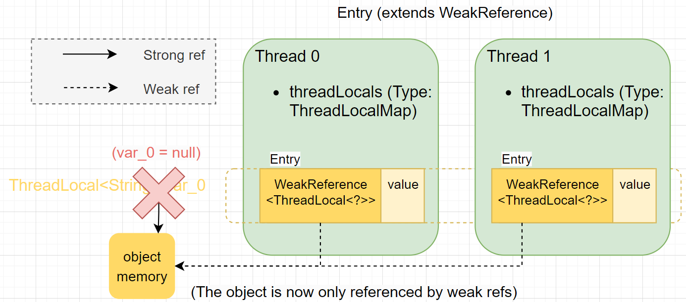

# `ThreadLocal`


### Relation between `Thread`/`ThreadLocal`/`ThreadLocalMap`

1. `Thread` has a field `threadLocals` of type `ThreadLocalMap`, which *physically* stores all the thread-local variables specific to current thread.

2. Under the hood, `ThreadLocalMap` is an array of `Entry`s (custom-defined hash map). `Entry` is a key-value pair.

3. On the other hand, `ThreadLocal` is provided for developers. It *logically* arranges the same variable (but have different copies that belongs to each thread).

   > Ref: `ThreadLocal`是一个壳子，真正的存储结构是`ThreadLocal`里有`ThreadLocalMap`这么个内部类。`ThreadLocal`本身并不存储值，它只是作为key来让线程从`ThreadLocalMap`获取value。

4. `ThreadLocal` vs. `ThreadLocalMap`: 

   * `ThreadLocal` is *variable-wise*. `ThreadLocalMap` is *thread-wise*. (They are two different dimensions for the same thing!)
   * `ThreadLocal` is what the developer use directly. `ThreadLocalMap` cannot be accessed by developer.
   * `ThreadLocal` is the *logical* interface ("frontend"). `ThreadLocalMap` is the actual *physical* storage ("backend")


Simply put, `ThreadLocal` is only an access point for the developer and only stores some "meta-data" (like the name of this variable). The actual data is stored inside each thread.


Source code of `ThreadLocal.get()`:

```Java
public T get() {
    Thread t = Thread.currentThread();
    ThreadLocalMap map = getMap(t);
    if (map != null) {
        ThreadLocalMap.Entry e = map.getEntry(this);
        if (e != null) {
            @SuppressWarnings("unchecked")
            T result = (T)e.value;
            return result;
        }
    }
    return setInitialValue();
}
```


### Why `ThreadLocalMap` is the inner class of `ThreadLocal` ?

In this way developer can only access thread-local variables by `ThreadLocal`. No operations are exported outside of the `ThreadLocal` class. This keeps the `ThreadLocalMap` safe from random modification by user.

Also, `ThreadLocalMap` is decorated as package private, and`Thread` and `ThreadLocalMap` are in the same package, so that `Thread` can have direct access.


### Why the key of `Entry` is `WeakReference` ?

The picture below demonstrates the reason. Notice that the object `ThreadLocal` `var_0` has 2 references:

1. The ***strong*** reference itself (`var_0`)
2. The ***weak*** reference (`Entry` key)


Suppose that the key of `Entry` is also a strong reference. Then if `var_0` is set to `null`, the `ThreadLocal` object is still not ready for GC, since another strong reference still holds the object and prevents it from GC. **Memory leak happens :(**

> **Ref**: 对于`ThreadLocal`来说，即使我们使用结束，也会因为线程本身存在该对象的引用，处于对象可达状态，垃圾回收器无法回收。这个时候就会出现内存泄漏的问题。(*source: [ThreadLocal的Entry为什么要继承WeakReference? - 知乎 (zhihu.com)](https://www.zhihu.com/question/458432418)*)
>
> 
>
> **个人理解 `WeakReference` 的使用场景**：当你需要一个指向某个对象的引用（如进行一些读写访问和操作），但是当该对象的强引用一旦被移除，那么访问和操作就没有意义了，也应该立即被移除。这就需要用到 `WeakReference`。因此，`WeakReference` 一般也是和强引用同时使用的，也即单独使用 `WeakReference` 指向一个对象没有任何意义。


But the key of `Entry` is a weak reference. Therefore when `var_0 = null`, the `ThreadLocal` object is removed as soon as GC happens. In this way, **no memory leak** of `TheadLocal` will take place :)


`ThreadLocal` object being set to null:



After garbage collection:


### Another question: how to remove `Entry`'s value?

The above section explains how `Entry` ***key*** is designed as `WeakReference` to avoid memory leak. However, memory leak may also happen to `Entry` ***value***. As shown in the above picture, when `ThreadLocal` is garbage collected, the value of `Entry` is still there! It points to an Object that will not be used anymore.

But don't worry, in `ThreadLocal` class there is a method `expungeStaleEntry()` for clearing unused entry in `ThreadLocalMap`'s table (setting value to `null`). This method will be called by `get`/`set`/`remove` methods when `null` key is encountered (see details in source code).

In conclusion, **memory leak of `Entry` value would rarely happen** as long as the `null` Entry is later `get`/`set`/`remove`. But anyway, it is a **good practice to manually call `remove` method** when we don't need a `ThreadLocal` object anymore, especially when handling a thread back to its **thread pool**.


### Code sample

```java
package com.example.demo;

import java.lang.ThreadLocal;
import java.lang.Thread;
import java.util.stream.IntStream;

public class Main {

    static ThreadLocal<String> var_0 = new ThreadLocal<String>() {
        @Override
        protected String initialValue() {
            return "default";
        }
    };
    static ThreadLocal<Integer> var_1 = new ThreadLocal<>();
    static ThreadLocal<Double> var_2 = new ThreadLocal<>();

    public static void main(String[] args) {
        IntStream.range(0, 5).forEach(i -> new Thread(() -> {
            // Print initial value of var_0, var_1, var_2 in each thread
            System.out.println("In thread: " + Thread.currentThread().getName() + " var_0: " + var_0.get());
            System.out.println("In thread: " + Thread.currentThread().getName() + " var_1: " + var_1.get());
            System.out.println("In thread: " + Thread.currentThread().getName() + " var_2: " + var_2.get());

            // Set var_0, var_1, var_2 in each thread
            var_0.set("Hallo" + i);
            var_1.set(i);
            var_2.set(i + 0.01);

            // Print new value of var_0, var_1, var_2 in each thread
            System.out.println("In thread: " + Thread.currentThread().getName() + " var_0: " + var_0.get());
            System.out.println("In thread: " + Thread.currentThread().getName() + " var_1: " + var_1.get());
            System.out.println("In thread: " + Thread.currentThread().getName() + " var_2: " + var_2.get());
        }).start());
    }
}
```

Execution output:

```tex
In thread: Thread-1 var_0: default
In thread: Thread-2 var_0: default
In thread: Thread-0 var_0: default
In thread: Thread-1 var_1: null
In thread: Thread-4 var_0: default
In thread: Thread-3 var_0: default
In thread: Thread-3 var_1: null
In thread: Thread-2 var_1: null
In thread: Thread-2 var_2: null
In thread: Thread-3 var_2: null
In thread: Thread-4 var_1: null
In thread: Thread-1 var_2: null
In thread: Thread-0 var_1: null
In thread: Thread-1 var_0: Hallo1
In thread: Thread-4 var_2: null
In thread: Thread-3 var_0: Hallo3
In thread: Thread-3 var_1: 3
In thread: Thread-2 var_0: Hallo2
In thread: Thread-4 var_0: Hallo4
In thread: Thread-1 var_1: 1
In thread: Thread-0 var_2: null
In thread: Thread-4 var_1: 4
In thread: Thread-2 var_1: 2
In thread: Thread-0 var_0: Hallo0
In thread: Thread-0 var_1: 0
In thread: Thread-0 var_2: 0.01
In thread: Thread-4 var_2: 4.01
In thread: Thread-3 var_2: 3.01
In thread: Thread-2 var_2: 2.01
In thread: Thread-1 var_2: 1.01

Process finished with exit code 0
```

（`ThreadLocal` 源码注释里给出的例子也不错）


### 应用实战 & 注意事项

`ThreadLocal` 很常用，如存储Web请求级别的信息上下文。追踪框架 MDC (Mapped Diagnostic Context) 的底层实现就是使用了 `ThreadLocal`。

在自己使用 `ThreadLocal` 时，需要注意两点：

1. 及时清理，防止内存泄漏（一般情况下无需手动清理，但是以防万一最好在每次使用完后清理掉当前线程的数据）
2. 在使用线程池的时候，**必须**及时清理（否则复用的线程会使用旧的ThreadLocal数据）


### Ref


>  * [ThreadLocal的Entry为什么要继承WeakReference? - 知乎 (zhihu.com)](https://www.zhihu.com/question/458432418)
>  
>  *  [cnblogs.com](https://www.cnblogs.com/lingyejun/p/13380348.html)
>  * [zhihu.com](https://zhuanlan.zhihu.com/p/102744180)