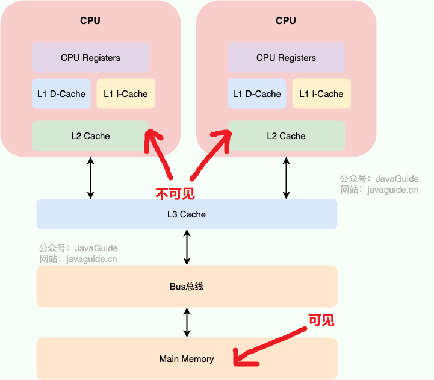

### 线程安全的三大特性

1. **原子性**
   * 思考：Java 中执行 a++ 是否是原子性的？（不是原子性）
   * 满足原子性的 Java 特性：synchronized，Lock，atomic工具类
2. **内存可见性**
   
   * ”不可见“ 是由于**多核CPU的硬件架构**引入的问题：CPU 每个核内的多级缓存会暂存数据，每次需要获取这些数据就不会从内存中取了，导致CPU core 1 和 CPU core 2 相互“不可见”。因此我们希望，运行在不同core上的两个线程对数据的修改，相互之间是”可见的“。
   * 满足可见性的 Java 特性：synchronized，volatile，Lock
   
   
   
3. **有序性**
   
   * ”不有序“是由于**编译器或处理器**会对指令重排序以提高性能，而引入的问题。在单线程情况下，没有任何问题；但是多线程的时候就有问题了
   * 典型例子：懒汉式单例模式
   
     ```java
     public class LazySingleton {
         
         // 为什么要加volatile？
         private static volatile Object singletonObject;
         
         private LazySingleton() {}
         
         public static Object getInstance() {
             if (singletonObject == null) {
                 synchronized(LazySingleton.class) {
                     if (singletonObject == null) {
                         /* 
                          * 关键问题：这里new Object() 底层发生了什么？
                          *   1.mem = allocate() 分配对象内存空间
                          *   2.ctorInstance(mem) 初始化对象
                          *   3.singletonObject = mem 将内存空间地址赋值给对象引用
                          * JIT编译器可能指令重排序，实际执行顺序会变成1->3->2
                          */
                         singletonObject = new Object();
                     }
                 }
             }
             return singletonObject;
         }
     }
     ```
   
     > 在JVM的优化下，步骤2和3有可能交换执行顺序，导致当线程A对 `instance` 进行创建时，线程B 也同时获取 `instance`，此时 `instance` 已经有所指向（但实际上对象还未真正初始化）。这样的话就导致线程B 获取的 `instance` 是有问题的（未完全创建好）
   
   * happen-before 原则
   * 满足不有性的 Java 特性：volatile
   
   


> 注：这关于线程安全的三个特性不易记忆，因为三者是由于不同的原因引起的。最主要的是要记忆这些根因


### JMM (Java Memory Model)

> 这是一个比较常见的问题，很多初学者非常容易搞混。 **Java 内存区域**和**JMM**内存模型是完全不一样的两个东西。前者是JVM的各种内存区（PC、栈、本地方法栈、堆、方法区/metaSpace），后者是规定了从 Java 源代码到 CPU 可执行指令的这个转化过程要遵守哪些和**并发相关的原则和规范**（**JSR 133**）


#### Happens-before 原则

> happens-before 原则（JSR-133的一部分）的诞生是为了程序员和编译器、处理器之间的平衡：
>
> 1. 程序员追求的是易于理解和编程的**强内存模型**，遵守既定规则编码即可，让并发编程的简易性最大化
> 2. 编译器和处理器追求的是较少约束的**弱内存模型**，让它们尽己所能地去优化性能，让性能最大化


### Java 中保护线程安全的常见方法（重要）

1. synchronized 关键字
2. volatile 修饰符
3. Atomic 相关类
4. Lock


### 总结

以上概念的区别和关联往往容易混淆，简单总结一下：

* 首先，这些概念只在多线程场景下的讨论有意义
* 线程安全的三个特性是宏观的概念，不限于Java 语言
* JMM 是 Java 语言中对这三个特性的一些规范（Specification）
* JMM 等价于 JSR-133
* Happens-before 原则是 JMM 的一部分
* Java 中保护线程安全的常见方法（如 synchronized, volatile）是 Java 语言中对三个特性的一些实现工具


### Ref

* （极力推荐阅读）[JMM（Java 内存模型）详解 | JavaGuide](https://javaguide.cn/java/concurrent/jmm.html#happens-before-和-jmm-什么关系)
* happens-before 的8条规则：[Java - Understanding Happens-before relationship](https://www.logicbig.com/tutorials/core-java-tutorial/java-multi-threading/happens-before.html)
* JSR-133