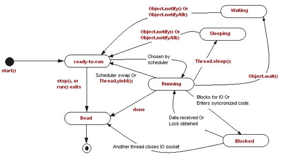
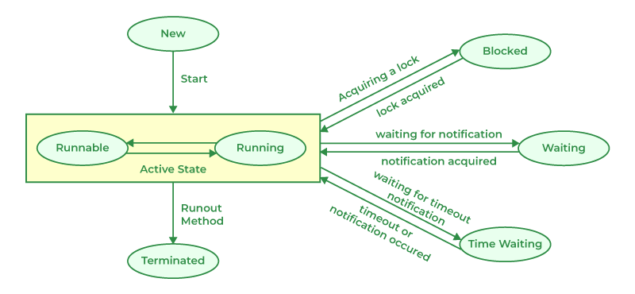

# Object.wait()/notify()

### 基本概念

* wait() 和 notify() 是 Object 类的方法
* wait() 和 notify() 用于线程间通信（特别是在Producer-Consumer 模型中）
* wait() 和 notify() 只能在 synchronized 代码块或 synchronized 方法中使用，否则会抛出 `IllegalMonitorStateException` 
* `wait()` 会使线程进入等待状态（*WAITING*），并释放锁
* `notify()` 会唤醒**随意一个**等待状态的线程，`notifyAll()` 会唤醒**全部**等待状态的线程。“唤醒”是指使线程从等待状态（*WAITING*）进入就绪状态（*RUNNABLE*），等待CPU的调度。当该线程获得CPU时间片时，线程状态变为运行状态（*RUNNING*），并尝试获取在 `wait()` 执行后释放的锁。如果成功获取了锁，则继续运行线程（*RUNNING*）；如果由于线程竞争未成功获取锁，则线程进入阻塞状态（*BLOCKED*）


### 复习：Java线程的几种状态

> （Java文档：[Thread.State (Java Platform SE 8 )](https://docs.oracle.com/javase/8/docs/api/java/lang/Thread.State.html)）
>
> A thread state. A thread can be in one of the following states:
>
> - [`NEW`](https://docs.oracle.com/javase/8/docs/api/java/lang/Thread.State.html#NEW)
>   A thread that has not yet started is in this state.
> - [`RUNNABLE`](https://docs.oracle.com/javase/8/docs/api/java/lang/Thread.State.html#RUNNABLE)
>   A thread executing in the Java virtual machine is in this state.
> - [`BLOCKED`](https://docs.oracle.com/javase/8/docs/api/java/lang/Thread.State.html#BLOCKED)
>   A thread that is blocked waiting for a monitor lock is in this state.
> - [`WAITING`](https://docs.oracle.com/javase/8/docs/api/java/lang/Thread.State.html#WAITING)
>   A thread that is waiting indefinitely for another thread to perform a particular action is in this state.
> - [`TIMED_WAITING`](https://docs.oracle.com/javase/8/docs/api/java/lang/Thread.State.html#TIMED_WAITING)
>   A thread that is waiting for another thread to perform an action for up to a specified waiting time is in this state.
> - [`TERMINATED`](https://docs.oracle.com/javase/8/docs/api/java/lang/Thread.State.html#TERMINATED)
>   A thread that has exited is in this state.
>
> A thread can be in only one state at a given point in time. These states are virtual machine states which do not reflect any operating system thread states.






### Code demo 1

```java
/**
 * Demo1: 基本概念
 */
public class WaitNotifyDemo {

    private static final Object lock = new Object();

    public static void main(String[] args) throws InterruptedException {
        for (int i = 0; i < 3; i++) {
            new Thread(() -> {
                synchronized (lock) {
                    System.out.println("Start thread: " + Thread.currentThread().getName());
                    try {
                        Thread.sleep(1000);
                        System.out.println("Waiting... " + Thread.currentThread().getName());
                        // 释放lock，线程进入WAITING状态
                        lock.wait();
                        // 另一线程调用notifyAll()后，当前线程获取CPU时间片，线程进入RUNNING状态
                        // 然后尝试抢占lock，有两种情况：
                        //   1.抢占成功，则继续RUNNING
                        //   2.抢占失败，则线程进入BLOCKED状态
                        System.out.println("Notified! " + Thread.currentThread().getName());
                        Thread.sleep(1000);
                    } catch (InterruptedException e) {
                        throw new RuntimeException(e);
                    }
                    System.out.println("End thread: " + Thread.currentThread().getName());
                }
            }).start();
        }

        Thread.sleep(5000);

        new Thread(() -> {
            synchronized (lock) {
                System.out.println("=== Start notify thread: " + Thread.currentThread().getName());
                try {
                    Thread.sleep(1000);
                    // 将所有WAITING线程，
                    lock.notifyAll();
                } catch (InterruptedException e) {
                    throw new RuntimeException(e);
                }
                System.out.println("=== Nice sleep for 1s :)" + Thread.currentThread().getName());
            }
        }).start();
    }
}
```


### Code demo 2

```java
/**
 * Demo2: 使用wait/notify实现一个简单的CountDownLatch
 */
public class MainMultiThread2 {

    private static final Object lock = new Object();

    private static volatile int counter = 3;

    public static void main(String[] args) throws InterruptedException {
        // Simulate 3 worker threads
        for (int i = 0; i < 3; i++) {
            new Thread(() -> {
                int sleepDuration = (int) (Math.random() * 2000 + 1000);
                System.out.println("Start thread: " + Thread.currentThread().getName() + " , wait for milliseconds: " + sleepDuration);
                try {
                    Thread.sleep(sleepDuration);
                    System.out.println("Sleep finished!");
                } catch (InterruptedException e) {}
                synchronized (lock) {
                    System.out.println("LOCK!");
                    try {
                        counter--;
                        System.out.println(counter);
                        lock.wait();
                    } catch (InterruptedException e) {}
                    System.out.println("End thread: " + Thread.currentThread().getName());
                }
            }).start();
        }

        // Barrier thread (here simply main thread)
        System.out.println("=== Start barrier listening in thread: " + Thread.currentThread().getName());
        while(counter > 0) {}
        synchronized (lock) {
            System.out.println("=== notifyAll");
            lock.notifyAll();
        }
    }
}
```


