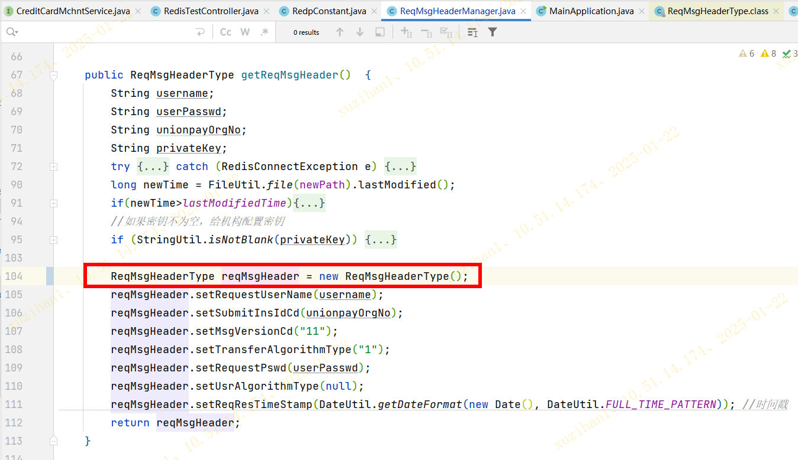

# 问题分析 - 运管代码里的线程安全问题
### 背景
代码review的时候，发现了一个线程安全的问题

### 代码分析

运管代码里的 `ReqMsgHeaderManager` 类的 `getReqMsgHeader()` 方法中出现了线程不安全问题，具体分析如下：
1. `ReqMsgHeaderManager` 类为单例（`@Component` 注解）
2. `ReqMsgHeaderManager` 类的 `reqMsgHeader` 属性也是单例（代码104~107行）
3. 此时，假设有两个Web请求（记为A和B）并发访问 `getReqMsgHeader()` 方法，按如下顺序执行：
   1. A执行114行
   2. B执行114行
   3. A再执行115行
4. 这样的话，结果就是A线程115行返回的 `reqMsqHeader` 的 `reqResTimeStamp` 字段，实际上是B线程的！这就导致了线程不安全！

(截图1)

(截图2)

### 总结

其实这是一个很典型的八股文问题：**Spring中的Bean是否线程安全？**（见：[Spring常见面试题总结 | JavaGuide](https://javaguide.cn/system-design/framework/spring/spring-knowledge-and-questions-summary.html#bean-是线程安全的吗)）

想触发Spring Bean的线程不安全，需要两个条件同时满足：
* Bean @Scope 是 singleton
* Bean 是有状态的

在以上的代码分析中，可以看出：
* Bean `ReqMsgHeaderManager` 使用默认的 @Scope，也即 singleton
* Bean `ReqMsgHeaderManager` 中维护了一个单例的对象 `reqMsgHeader`
* `reqMsgHeader` 中维护了一个字段 `reqResTimeStamp`，需要new Date() 来赋值，这样的话这个字段就导致了Bean `ReqMsgHeaderManager` 是状态的！

因此，满足了上述两个触发条件，导致线程不安全。

#### 解决方法
破环任意一个条件即可：
1. Bean `ReqMsgHeaderManager`使用 @Scope prototype
2. Bean `ReqMsgHeaderManager` 中**不要**维护了一个单例的对象 `reqMsgHeader`，而是每个线程都new一个新的对象
3. 删除有状态的 new Date()

或者加锁：
4. 使用线程安全工具（synchronized, Lock）

第三种方法肯定行不通，因为不满足业务需求了；第四种方法没必要；剩下第一种和第二种，肯定选择第二种，具体代码如下：

### Ref

[Spring常见面试题总结 | JavaGuide](https://javaguide.cn/system-design/framework/spring/spring-knowledge-and-questions-summary.html#bean-是线程安全的吗)
