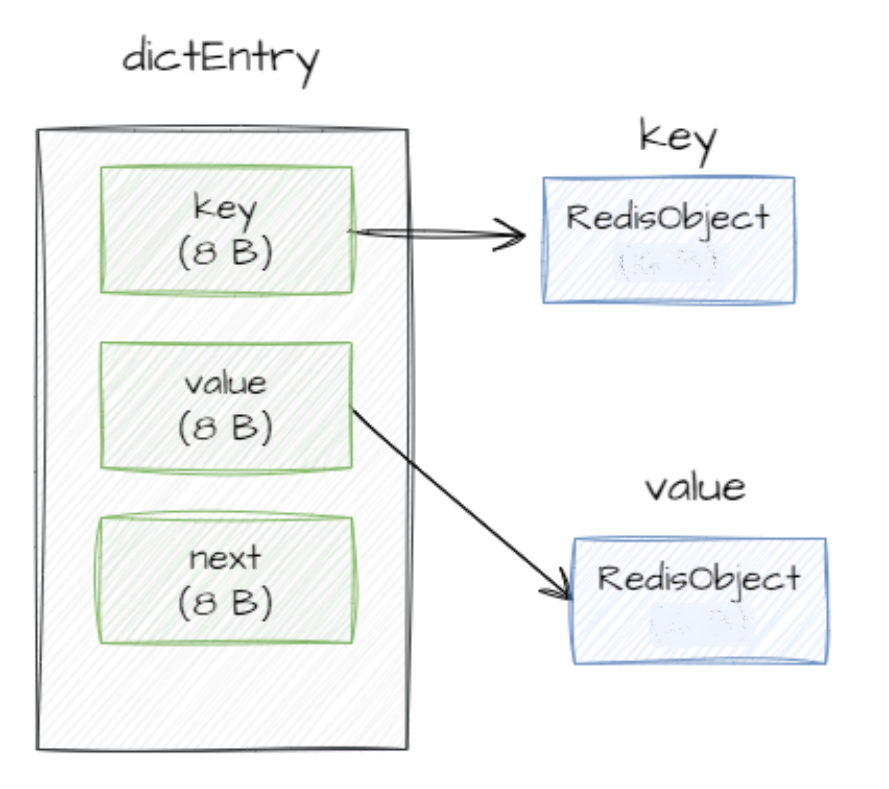
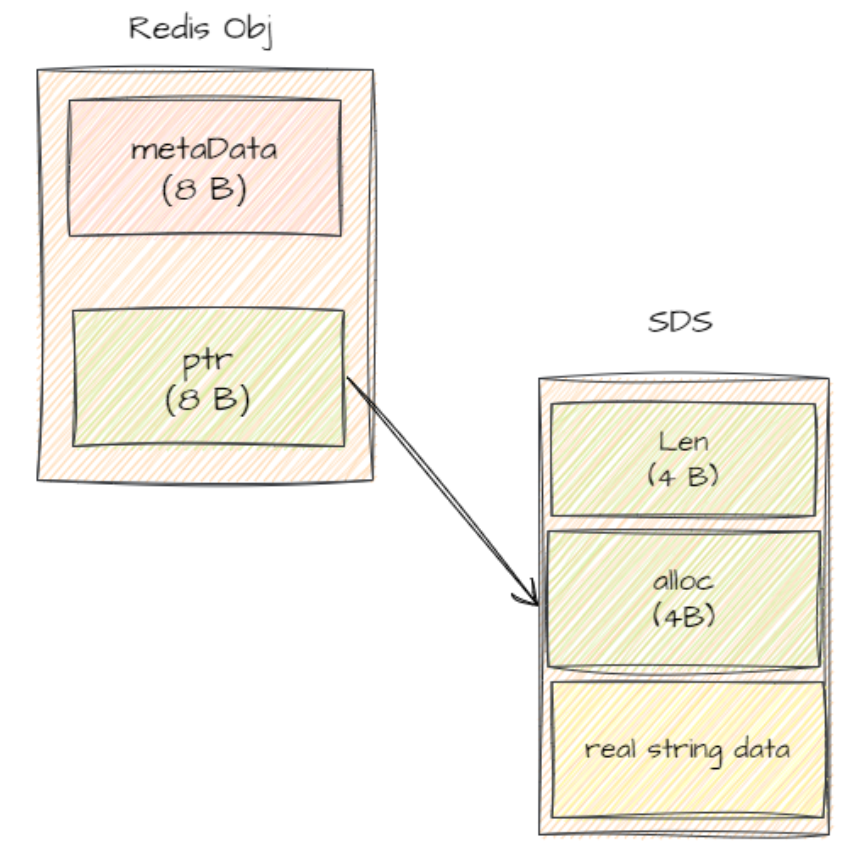
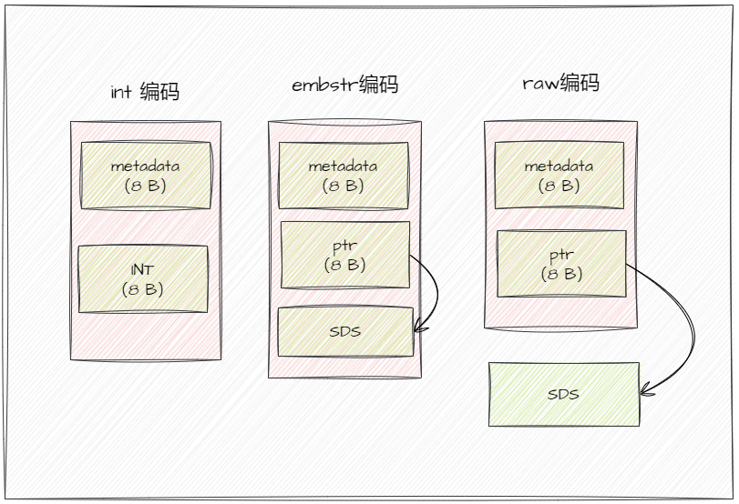

# Redis 性能调优

### 调优方向

1. 提高读写速度
2. 降低存储空间


### 调优工具

* redis-benchmark
* `MONITOR` 命令
* `DEBUG OBJECT` 命令
* `MEMORY USAGE` 命令


### 方法一：选取合适的数据类型

对于数据类型的选取，我们往往会直接使用 String 类型，原因往往是：

- 使用简单，适用场景多
- 容易设置TTL（相比集合类型，如 Hash/Set）
- 对其它数据类型的使用和原理并不是太了解。所以这个时候往往会忽视在特定场景下使用某种数据类型会比String性能高出很多的可能性，比如使用Hash结构来提高某实体某个项的修改等。

综上，对于Redis的优化可以从数据类型的使用层面进行，这就需要了解各个数据类型的存储原理。


#### String 类型的存储原理

>  参考《String 为什么不好用了？—— 浅析 Redis 数据结构》：https://mp.weixin.qq.com/s/rvE8M7fLV5A5m0bPe-p5bA


Redis 的顶层数据结构是一张 Hash 表，哈希表的每一项是一个 `dictEntry` 的结构体，用来指向一个 key-value。每个键、每个值的底层存储又都是一个 `RedisObject`（也即一个键值对的底层存储是2个 `RedisObject`）



而 `RedisObject` 的结构如下：




##### 编码格式

* 当保存的是 **Long 类型整数**时，`RedisObject`中的指针就直接赋值为整数数据，这样就不用额外的指针再指向整数了，节省指针的空间开销。这种方式叫做 **int 编码**

* 当保存的是**字符串数据**且**长度小于等于44字节**时，`RedisObject`中的元数据、指针和 SDS 是一块连续的内存区域，这样就可以避免内存碎片。这种布局方式被称为 **embstr 编码**

* 当**字符串大于44字节**时，SDS 的数据量就开始变多了，Redis 就不再把 SDS 和 `RedisObject`布局在一起了，而是会给 SDS 分配独立的空间，并用指针指向 SDS 结构。这种布局方式被称为 **raw 编码**模式

  




测试脚本（依次插入长度为`i` 的字符串，使用`DEBUG OBJECT` 命令查看数据的 encoding 类型）：

```shell
str=""
for i in $(seq 1 100);
do
    str="${str}a"
    redis-cli SET $i $str
    echo SET $i $str
    echo $(redis-cli DEBUG OBJECT "$i")
    echo $(redis-cli MEMORY USAGE "$i")
done
```


#### Hash类型的存储原理

encoding: ziplist


#### Zset 类型的存储原理

encoding: skiplist


### 方法二：持久化机制（RDB/AOF）的优化