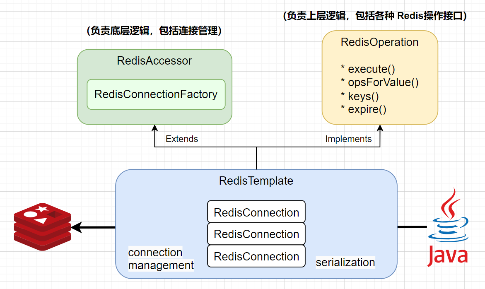
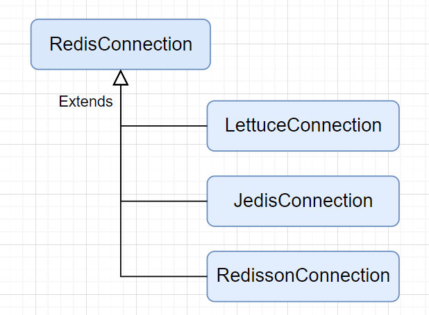

# Spring Data Redis

### Simple Example

First we need to add the starter dependency in POM. This will register a bean of type `RedisTemplate` to the Spring container by auto-configuration, as the access point for us to use later.

```xml
<dependency>
    <groupId>org.springframework.boot</groupId>
    <artifactId>spring-boot-starter-data-redis</artifactId>
</dependency>
```


Then create a simple controller to perform some common Redis operations:

```java
@RestController
public class RedisController {

    // Here @Autowired cannot be used (but why? If the generics are removed then it's ok. Wierd...)
    @Resource
    private RedisTemplate<String, Integer> redisTemplate;

    @RequestMapping("/redis-operations-test")
    public String redisOperationsTest() {
        redisTemplate.opsForValue().set("test-key", 42);
        redisTemplate.expire("test-key", 60, TimeUnit.SECONDS);
        Integer val = redisTemplate.opsForValue().get("test-key");
        return null != val ? val.toString() : "NULL";
    }
}
```

We're done! Now may start Redis server and test the API and you will see the change in Redis.

Redis client configurations can also be further customized (e.g. serializer of Redis key and value), by defining a configuration class:

```java
@Configuration
public class RedisConfig {
    
    @Bean
    public RedisTemplate redisTemplate(RedisConnectionFactory redisConnectionFactory) {
        // Configuration goes here...
        RedisTemplate<String, Object> template = new RedisTemplate<>();
        template.setConnectionFactory(jedisConnectionFactory());
        return template;
    }
}
```

> Ref: https://www.baeldung.com/spring-data-redis-tutorial


### Under the hood

The `RedisTemplate` offers a high-level abstraction for Redis interactions. While `RedisConnection` offers low-level methods that accept and return binary values (`byte` arrays), the template takes care of **serialization and connection management (retrieving/closing Redis connections or handling connection lifecycle exceptions)**, freeing the user from dealing with such details.




The main logic of `RedisTemplate` is inside the `execute` method. 

阅读源码可以发现，`RedisTemplate` 的各个API方法（如 `keys`, `opsForValue`）最终都会调用 execute方法，也即 template方法设计模式。`execute` 方法负责整个连接 `Redis` 的流程，主要包括：

1. 从 `RedisConnectionFactory` 中获取一个 `RedisConnection`
2. 调用 `RedisConnection` 的对应 Redis API方法
3. 释放连接 `RedisConnection`（*releaseConnection*）


```java
// The `execute` method inside class `RedisTemplate`:

@Nullable
public <T> T execute(RedisCallback<T> action, boolean exposeConnection, boolean pipeline) {
    Assert.isTrue(this.initialized, "template not initialized; call afterPropertiesSet() before using it");
    Assert.notNull(action, "Callback object must not be null");
    RedisConnectionFactory factory = this.getRequiredConnectionFactory();
    RedisConnection conn = RedisConnectionUtils.getConnection(factory, this.enableTransactionSupport);

    Object var11;
    try {
        boolean existingConnection = TransactionSynchronizationManager.hasResource(factory);
        RedisConnection connToUse = this.preProcessConnection(conn, existingConnection);
        boolean pipelineStatus = connToUse.isPipelined();
        if (pipeline && !pipelineStatus) {
            connToUse.openPipeline();
        }

        RedisConnection connToExpose = exposeConnection ? connToUse : this.createRedisConnectionProxy(connToUse);
        T result = action.doInRedis(connToExpose);
        if (pipeline && !pipelineStatus) {
            connToUse.closePipeline();
        }

        var11 = this.postProcessResult(result, connToUse, existingConnection);
    } finally {
        RedisConnectionUtils.releaseConnection(conn, factory, this.enableTransactionSupport);
    }

    return var11;
}
```


### Redis 的三个客户端

对于 `RedisTemplate` 底层的 `RedisConnection`，Spring 提供了三个具体的实现类（对应 Redis的三个客户端）：

* `LettuceConnection`
* `JedisConnection`
* `RedissonConnection`



实际使用哪个实现，取决于依赖的 pom组件。具体客户端的使用（如线程池等）可以参考另一篇note。


### Redis客户端: Jedis vs. Lettuce

|                                | Jedis               | Lettuce                 |
| ------------------------------ | ------------------- | ----------------------- |
| 同步 or 异步                   | 同步（阻塞式I/O）   | 异步（非阻塞式I/O）     |
| 并发场景                       | 适用于低并发        | 适用于高并发            |
| 线程安全性                     | 非线程安全          | 线程安全                |
| 线程池管理方式                 | 手动管理            | 自动管理                |
| Spring Data Redis 的默认客户端 | Spring 1.x 默认使用 | Spring 2.x以上 默认使用 |


### Redis连接池的使用

Jedis 和 Lettuce 底层使用的是 apache.commons.pool2 的连接池，然而在Spring Boot 中，两者的默认配置有区别

* Jedis 默认使用连接池（因为非线程安全）
* Lettuce 默认不使用连接池（因为 Lettuce 底层使用的 Netty 用到多路复用技术，一个 Lettuce 连接就能支持并发请求）


### Misc

1. The template is thread-safe and can be reused across multiple instances.
2. `RedisTemplate` 和 `RedisConnection` 是一对多的关系（？）

3. `RedisTemplate` uses a Java-based serializer for most of its operations. This means that any object written or read by the template is serialized and deserialized through Java.


> Ref:
>
> * https://docs.spring.io/spring-data/redis/reference/redis/template.html
> * https://www.cnblogs.com/xiaopan-cp9/p/15875914.html