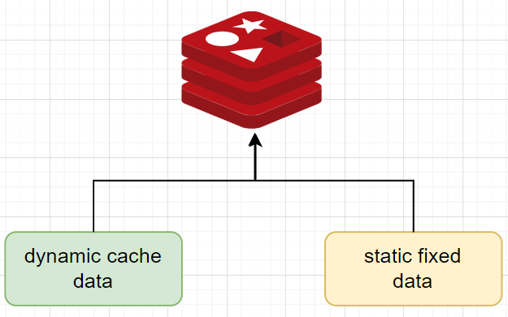
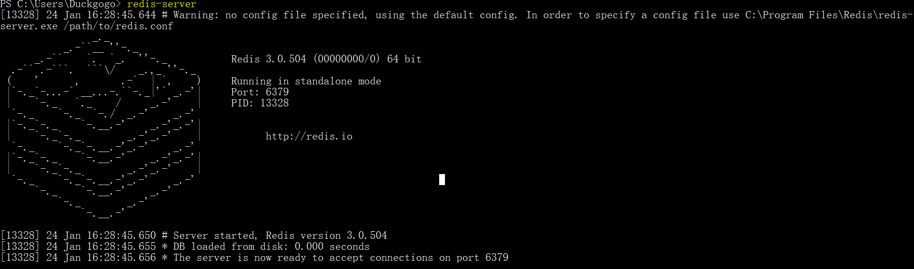
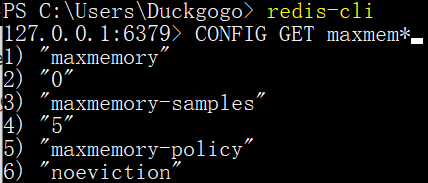
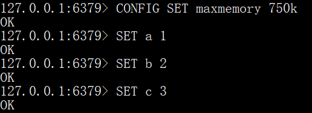
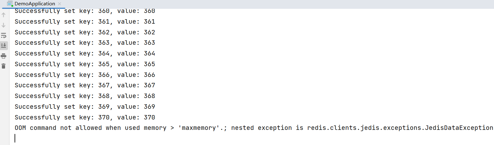
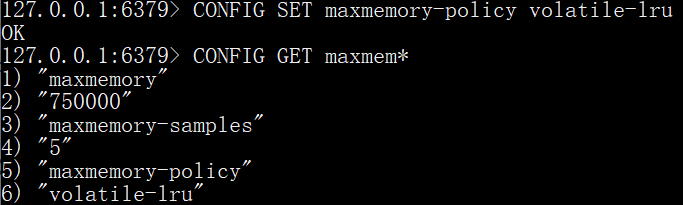
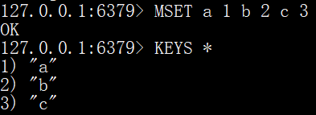
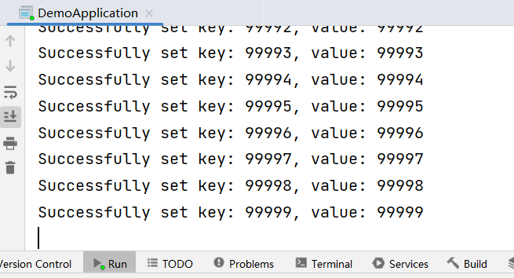
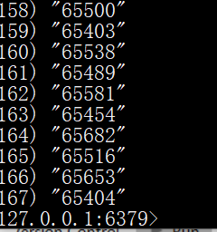
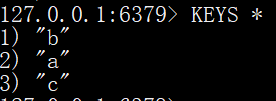

# How `volatile-*` policies work

> Ref: [Redis configuration file example | Redis](https://redis.io/docs/management/config-file/)


### Conclusion

Compared with `allkeys-*` policies, `volatile-*` policies **only evict keys with an expire TTL set** ("volatile" keys). Therefore these policies are suitable for storing both **cache data** and **fixed data**:

* **cache data**: dynamically changing, such as temporary data keyed as an UUID. These are the main part of Redis data.
* **fixed data**: not changing. Put in Redis only for faster retrieval, such as system configuration. Usually there is only a small number and be stored in Redis once the Spring backend started.



**So how to set keys as "volatile"?** This is achieved by setting an expiration TTL:

```shell
redis> SET a 1
"OK"
redis> EXPIRE a 100
(integer) 1
```

Now key `a` is volatile and *may be* evicted. If 3 seconds later the Redis memory is full, then it may evict key `a` according to the pre-set policy. If key `a` is not evicted, 100 seconds later it reaches TTL anyway and will be removed. (This is kind of tricky and not mentioned clearly in the official doc.)


### Show me the code

Below are the steps that validate the above-mentioned conclusion:

1. Start `redis-server` in standalone mode

   

2. Connect with `redis-cli`.

3. Check current Redis configurations related with `maxmemory` 

   

   (`maxmemory` is not limited and `maxmemory-policy` is `noeviction`)

4. Set `maxmemory` to a small number that is a bit larger than currently-used memory, simulating OOM afterwards. Set some **static fixed** keys.

   

5. Now write some simple code (with Spring Data Redis) to add some keys to fill the Redis memory:

   ```java
   package com.example.demo.controller;
   
   import org.springframework.data.redis.core.RedisTemplate;
   import org.springframework.web.bind.annotation.PostMapping;
   import org.springframework.web.bind.annotation.RestController;
   
   import javax.annotation.Resource;
   import java.util.concurrent.TimeUnit;
   
   @RestController
   public class RedisController {
       
       @Resource
       private RedisTemplate<String, Integer> myRedisTemplate;
   
       @PostMapping("/addKeys")
       public String addKeys() {
           try {
               for (int i=0; i<100000; i++) {
                   myRedisTemplate.opsForValue().set(String.valueOf(i), i);
                   // myRedisTemplate.expire(String.valueOf(i), 15, TimeUnit.SECONDS);
                   System.out.println(String.format("Successfully set key: %d, value: %d", i, i));
               }
           } catch (Exception ex) {
               System.out.println(ex.getMessage());
           }
           return "DONE";
       }
   }
   ```

   Execute result:

   

   (We can see that after setting key `370`, the memory is full. Since the `maxmemory-policy` is `noeviction`, Jedis throws OOM exception and new keys cannot be further added.)

6. Restart `redis-server`. Set small `maxmemory`. Change `maxmemory-policy` to `volatile-lru`.

   

7. Now we add some **none-volatile** keys:

   

8. Change code to add **volatile** keys (set an expiration TTL):

   ```java
   package com.example.demo.controller;
   
   import org.springframework.data.redis.core.RedisTemplate;
   import org.springframework.web.bind.annotation.PostMapping;
   import org.springframework.web.bind.annotation.RestController;
   
   import javax.annotation.Resource;
   import java.util.concurrent.TimeUnit;
   
   @RestController
   public class RedisController {
       
       @Resource
       private RedisTemplate<String, Integer> myRedisTemplate;
   
       @PostMapping("/addKeys")
       public String addKeys() {
           try {
               for (int i=0; i<100000; i++) {
                   myRedisTemplate.opsForValue().set(String.valueOf(i), i);
                   // Add key with expiration TTL of 15 seconds
                   myRedisTemplate.expire(String.valueOf(i), 15, TimeUnit.SECONDS);
                   System.out.println(String.format("Successfully set key: %d, value: %d", i, i));
               }
           } catch (Exception ex) {
               System.out.println(ex.getMessage());
           }
           return "DONE";
       }
   }
   ```

9. Run the code, the iteration will not throw exception. 

   

   During the iteration, if you check Redis with command `KEYS *` multiple times, you will see the number of keys are always around 166 (which reaches full memory). Also, the fixed keys (`a`, `b`, `c`) are not evicted, while other numbered keys are evicted to make space for new incoming added keys.

   

10. After the code execution, wait for 15 seconds and check `KEYS *`. Only the fixed keys (`a`, `b`, `c`) are there.

    


### Summary (policies and use cases)

| maxmemory-policy    | Use Case                                                     |
| ------------------- | ------------------------------------------------------------ |
| **noeviction**      | limited data (carefully use, may reach to OOM and new data cannot be written） |
| **allkeys-lru**     | **for most use cases**, especially for power-law distributed access |
|                     | for uniformly-distributed access                             |
| **volatile-lru**    | for storing cache data + fixed data, and for power-law distributed access |
| **volatile-random** | for storing cache data + fixed data, and for uniformly-distributed access |
| **volatile-ttl**    | when you need to customize TTL of each key. (This policy tends to give control with high granularity to developers, instead of deciding by Redis itself.) |

* *Note*: for `volatile-*` policies, if all keys have not set expiration TTL, then it policy is not effective and is equivalent to `noeviction`