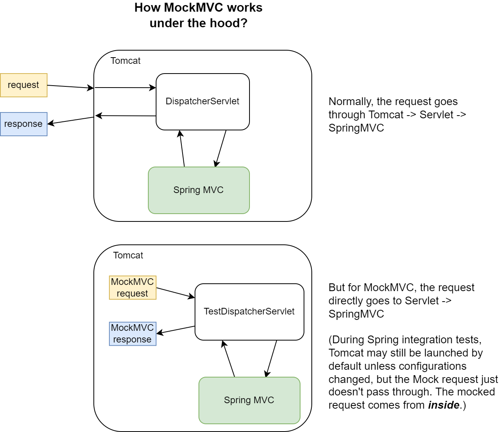

# Spring Testing

### *@WebMvcTest* vs. *@SpringBootTest*

* *@WebMvcTest* is designed for MVC-related tests, focusing on the web layer and providing easy testing for specific controllers
* *@SpringBootTest* creates a test environment by loading a full application context, including *@Components*, DB connections, and *@Service*, making it suitable for integration and system testing, similar to the production environment.

|                 | *@WebMvcTest*                 | *@SpringBootTest*                                            |
| --------------- | ----------------------------- | ------------------------------------------------------------ |
| Testing type    | unit testing (sliced testing) | integration testing                                          |
| Weight          | lightweight                   | heavyweight                                                  |
| What is mocked? | basically everything          | nothing except `MockMvc` (requests can also be real by using `TestRestTemplate`/`WebTestClient`) |

### MockMVC

> It performs full Spring MVC request handling but via mock request and response objects instead of a running server.

