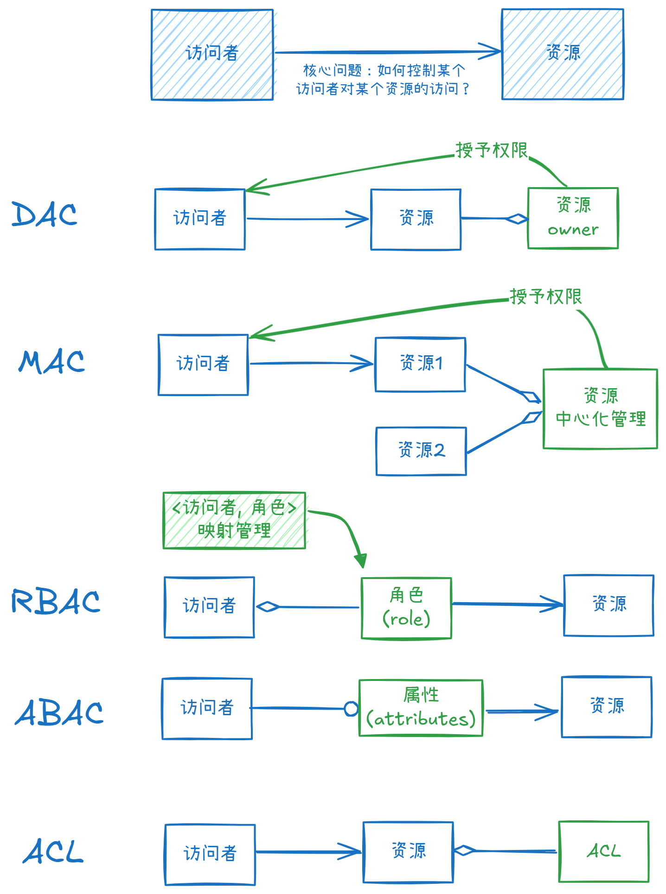
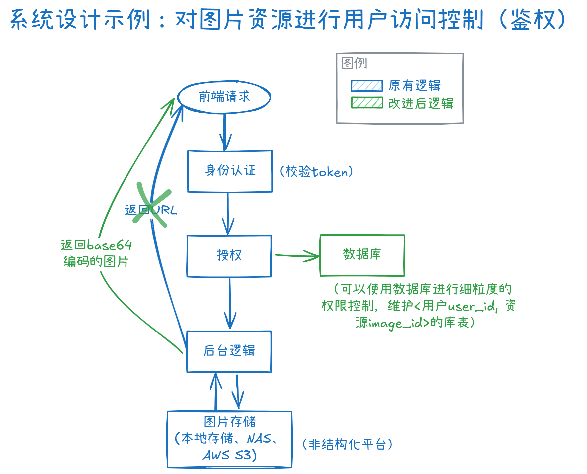

# 系统设计：访问控制模型（Access Control Models）

> 在信息安全领域，**访问控制（Access control）**是指对访问者向受保护资源进行访问操作的控制管理。该控制管理保证被授权者可访问受保护资源，未被授权者不能访问受保护资源。
>
> (src: Wikipedia)

## 5种常见模型

### 自主访问控制（Discretionary access control）

* **Example**: Permissions on Windows or Unix systems (e.g., "Read/Write/Execute" for User/Group/Others).

### 强制访问控制（Mandatory access control）
### 角色访问控制（Role-based access control）
### 属性访问控制（Attribute-based access control）

### 访问控制列表（Access control list）

* ACL vs. RBAC
  * RBAC 是中心化管理权限，ACL 是去中心化管理权限
  * RBAC 的关注重心在用户/角色侧，ACL 的关注重心在资源侧

### 总结

| Model    | Core Principle                                               | Best For                                                     | Key Advantage                                          | Key Disadvantage                                             |
| :------- | :----------------------------------------------------------- | :----------------------------------------------------------- | :----------------------------------------------------- | :----------------------------------------------------------- |
| **DAC**  | The **owner** of the resource decides access.                | Small, collaborative environments (e.g., home networks, small teams). | Simple, flexible, user-centric.                        | Insecure; prone to privilege creep and unauthorized sharing. |
| **MAC**  | A **central authority** (system) defines access via labels.  | Highly secure environments (e.g., military, government).     | Very secure; prevents data leaks; centralized control. | Complex to manage; inflexible; not user-friendly.            |
| **RBAC** | Access is granted based on a user's **role** within an organization. | Most business environments (e.g., corporations, hospitals, universities). | Scalable, manageable, reduces administrative overhead. | **Less granularity**; struggles with exceptions ("role explosion"). |
| **ABAC** | Access is granted based on **attributes** of the user, resource, action, and environment. | Dynamic, complex scenarios (e.g., cloud services, IoT).      | **Highly flexible and granular**; context-aware.       | Very complex to implement and manage; can be slow.           |
| **ACL**  | A **list** attached to a resource specifying which users can access it and how. | File systems, network devices (routers/firewalls).           | Simple, direct, and granular for individual resources. | Doesn't scale well; management becomes chaotic ("ACL spaghetti"). |

## 系统设计示例（渗透测试越权漏洞）

> **问题描述**：后端直接给前端返回了非结构化平台（用于图片存储）的资源URL，然后前端通过AJAX请求获得图片。这样的问题是，其他用户可能截获URL，越权访问存储在非结构化平台的图片（虽然我认为这不属于越权相关的信息安全问题，应该由 HTTPS 解决，这是两个正交的问题:sweat:）
>
> **解决方法**：舍弃原有的返回前端非结构化平台URL的逻辑，重构为由后端请求非结构化平台URL后，对图片进行Base64编码直接返回给前端。前端无需再发起AJAX请求获取图片资源。

