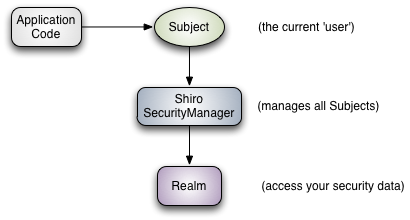
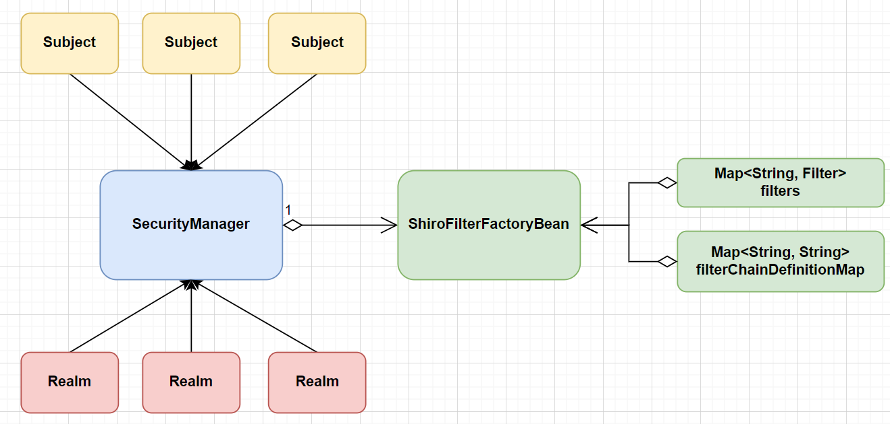
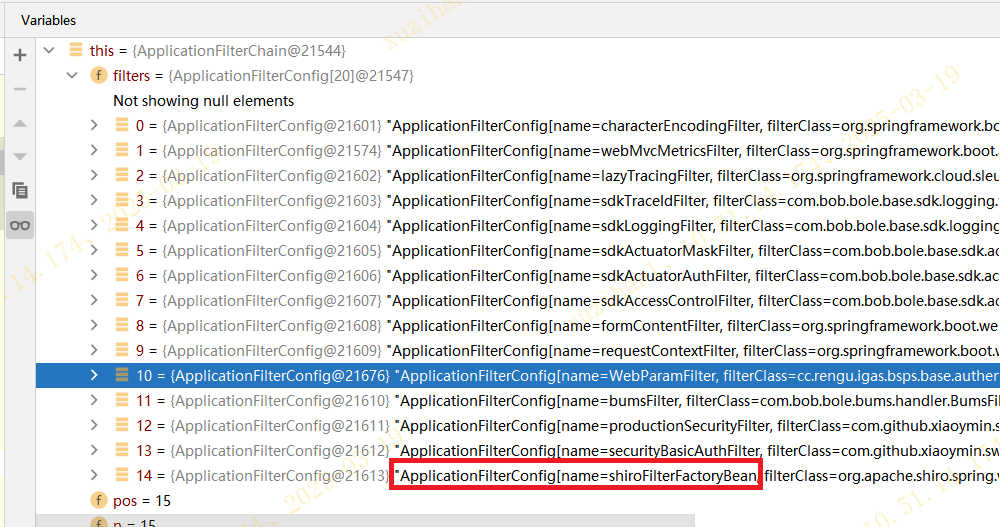
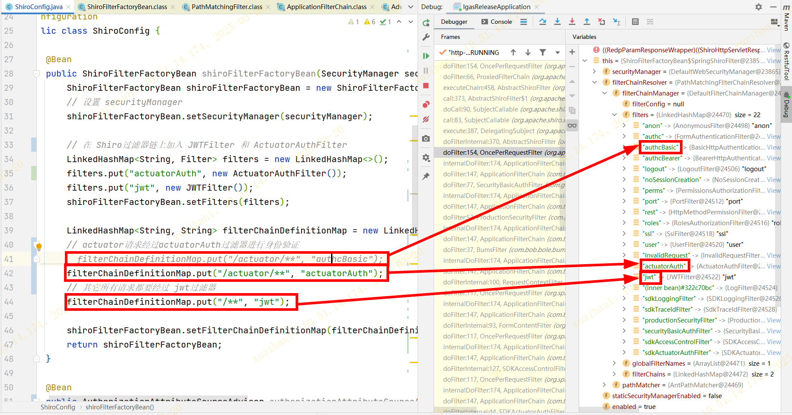
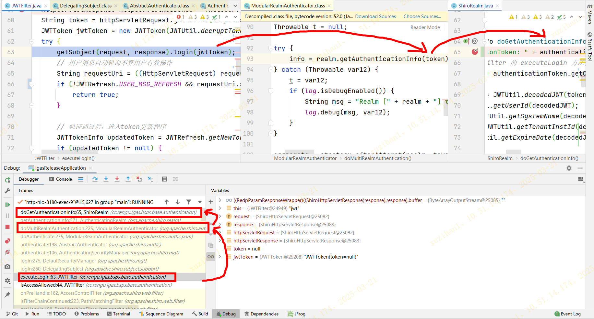
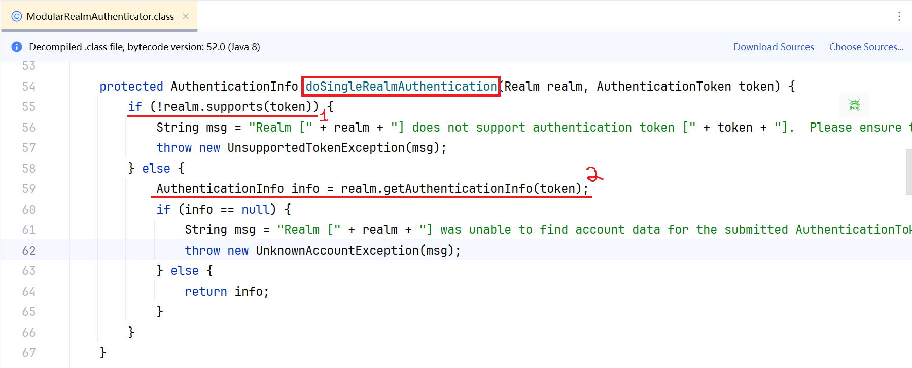
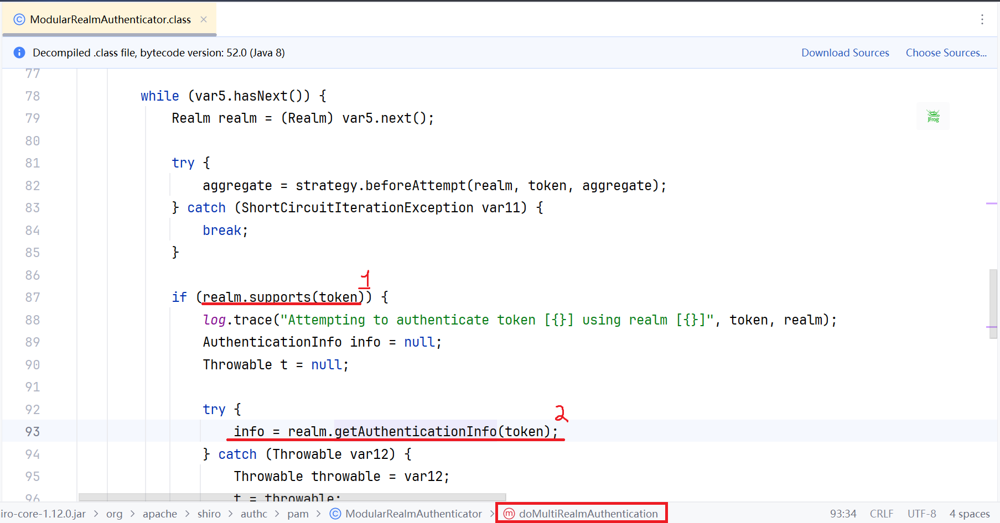

# Security library: Method 1 - Shiro

### What is Shiro?

官网上的两张图很好地解释了Shiro的基本架构和概念




三个基本概念：

* Subject(s)
* Security Manager
* Realm(s)


### Using Shiro in Spring Boot

> 如何在Spring/Spring Boot 项目中使用 Shiro 呢？Shiro 提供了 maven 依赖包 `shiro-spring`，主要就是通过这个包实现 Shiro 与 Spring 的集成


#### `ShiroFilterFactoryBean` 类

最重要的是 `ShiroFilterFactoryBean` 这个类，定义了Shiro主过滤器（defining the master Shiro Filter）。其中包含了以下字段：

* `filters`: `LinkedHashMap`类型，里面装有过滤器名称和示例的映射，如：
  * `filters.put("myFilter", new MyShiroFilter())`
  * `filters.put("jwtFilter", new JWTFilter())`
* `filterChainDefinitionMap`: `LinkedHashMap`类型，里面装有目标路径和使用的过滤器名称的映射，如：
  * `filterChainDefinitionMap.put("/myUrl/**", "myFilter")` ***-> 自定义filter***
  * `filterChainDefinitionMap.put("/**", "jwtFilter")` ***-> 自定义filter***
  * `filterChainDefinitionMap.put("/myLogin/**", "authcBasic")` ***-> 预置filter***


**疑问**

>  其实我在开发过程中，对这里有两个问题：
>
>  1. 这里的 filters 与 `shiro-core` 的三个基本概念之间的关系是什么？
>  2. filters 又是如何与 Realm 进行交互的？


第一个问题




第二个问题（以 `JWTFilter` 为例）

```text
1. Shiro 遍历当前 filterChain
2. 当遍历到 JWTFilter 时，会调用它的 preHandle 方法（由开发者覆写）
3. 之后会遍历所有的Realm，和 JWTFilter 里定义的support方法进行过校验，找到目标realm（不同的realm支持不同类型的token）
```


#### 代码示例

> 如果Spring项目中引入了 `shiro-spring` 的 Maven依赖，则会 autoconfigure 相关的 bean。
>
> 单步debug执行逻辑将在下文中一点点展示。首先，HTTP请求会经过 Tomcat 中的 `ApplicationFilterChain`，里面有在Spring 容器启动过程中，预先 autoconfigure 的各种拦截器（本例中有14个），其中一个就是上文提到的 `shiroFilterFactoryBean`。




> 跳过前13个拦截器的逻辑，单步debug执行到`shiroFilterFactoryBean` 的 `doFilter()` 逻辑，可以看出，`shiroFilterFactoryBean` 已经预先内置了21个filter（注意：这里的filter是Shiro的filter，和上面Tomcat的拦截器 filter 不是一个概念，也不在一个层级），开发者可以直接使用而无需自定义。对于特殊逻辑的filter，可以自定义（如示例中的 `jwt` 和 `actuatorAuth`）




> 进一步看 `jwt` 过滤器对应的 `JWTFilter` 类逻辑：
>
> 1. 在 `JWTFilter.executeLogin()` 方法中调用 Shiro 的 `login()` 方法（**这一步是开发者写的逻辑**）
> 2. `login()` 方法会进一步调用 Shiro 内部的 `doMultiRealmAuthentication()` 方法（**这一步是Shiro框架的逻辑**）
> 3.  `doMultiRealmAuthentication()` 方法反过来再去调用 `ShiroRealm.doGetAuthenticationInfo()`  （**这一步是开发者写的逻辑**）



> 再深入Shiro 框架的 `ModularRealmAuthenticator` 类看看（上面的第2步），它会去调用开发者自定义的 realm 的方法：
> 1. 调用 `realm.support(token)` 判断当前 realm 是否支持对该种类型的 token 的认证（authentication）
> 2. 如果第1步验证支持性通过，则继续调用 `realm.getAuthentication(token)`  实现认证
>
> 而且分了两种情况：单个Realm / 多个Realm
>
> （以下截图是开发者定义了单个 realm 的情况）




> （以下截图是开发者定义了多个 realm 的情况，会依次遍历来找到某一个用来认证的realm）




### Ref

* [Apache Shiro Architecture | Apache Shiro](https://shiro.apache.org/architecture.html)
* [Springboot基础学习之(十七):通过Shiro实现用户得到登录认证和授权_shiro 框架后台获取登录用户的权限-CSDN博客](https://blog.csdn.net/m0_52479012/article/details/130115867?utm_medium=distribute.pc_relevant.none-task-blog-2~default~baidujs_baidulandingword~default-8-130115867-blog-115731415.235^v43^pc_blog_bottom_relevance_base1&spm=1001.2101.3001.4242.5&utm_relevant_index=11)
* [ShiroFilterFactoryBean源码及拦截原理深入分析_shiro 源码在哪个bean 设置路由是否需要拦截-CSDN博客](https://blog.csdn.net/u012345283/article/details/44199791)


