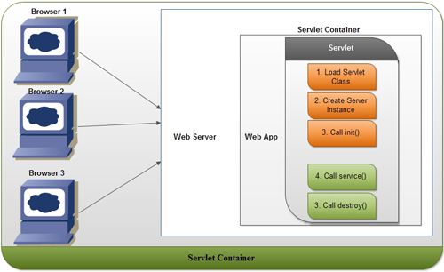
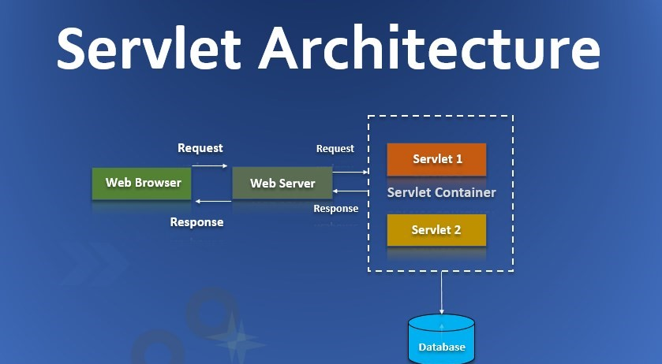

# Web application concepts

#### Servlet

  * `Servlet` is defined as a Java EE specification (a Java-specific concept!)

  * **(Informal) Definition**: Simply put, a Servlet is a class that handles requests, processes them and replies back with a response, running within a web server.

  * **Classes & interface**: `HttpServlet` is a subclass of `GenericServlet`, an implementation of the `Servlet` interface.

  * **Lifecycle**: `init()`, `service()`, `destroy()`

  * > **Servlet** is simply a Java class that have some methods you need to implement.
    >
    > **Servlet servers** (e.g **Tomcat**, Jetty) can host and abide by the applications that implemented the servlet.
    >
    > So whenever a request arrives these servlet web servers, the web server passes the request to your application by calling your servlet implementation.
    >
    > Over time, servlet implementations have gained autonomy and these days we don’t even implement it by hand, simply use some solutions such as **Spring MVC, Spring Boot**, etc., which they implemented themselves for us. We simply fill our endpoints and focus our business logic.
    >
    > **ref**: https://qr.ae/prlD3C

#### Servlet container

  * **Wikipedia**: A **web container** (also known as a **servlet container**) is the component of a web server that interacts with Jakarta Servlets. A web container is responsible for:

    1. managing the lifecycle of servlets (e.g. loading and unloading)
    2. mapping a URL to a particular servlet and ensuring that the URL requester has the correct access-rights
    3. creates and manages request and response objects (e.g. `HttpServletRequest` & `HttpServletResponse`)
    4. performs other servlet-management tasks

  * A servlet container may have many servlets inside (**one-to-many** relation).

  * > To use **servlets**, they need to be **registered** first so that a **container**, either JEE or Spring-based, can pick them up at start-up. In the beginning, the container instantiates a servlet by calling its `init()` method. 
    >
    > Now let's look at this from the point of view of a **container**, such as **Apache Tomcat** or Jetty. At start-up, it creates an object of `ServletContext`. The job of the `ServletContext` is to function as the server or container's memory and remember all the servlets, filters, and listeners associated with the web application, as described in its web.xml or equivalent annotations. Until we stop or terminate the container, `ServletContext` stays with it.
    >
    > 
    >
    > Whenever a client such as a browser, or a curl command, sends in a request, the container creates a new `HttpServletRequest` and `HttpServletResponse` object. It then passes on these new objects to the servlet's `service()` method. Based on the `HttpServletRequest`‘s method attribute, this method determines which of the `doXXX()` methods (e.g. `doPost()`) should be called.
    >
    > **ref**: https://www.baeldung.com/java-servlets-containers-intro

#### Web server/application server
( I think this is an ambiguous terminology...)

* It can refer to the whole software plus hardware stack at the server side
* It can also refer to merely the piece of software that is responsible for holding the application and response to HTTP requests (e.g. JVM)


#### Relations: servlet & servlet container & web server

In below diagram, the specific implementation of each component can be:

* Web Server -> JVM process
* Servlet Container -> Tomcat
* Web App -> Spring application
* Servlet -> the underlying Servlet instance taken care by Spring (represented by `ApplicationContext`?)
* Bean -> objects that are created by and exists inside the Servlet's `ServletContext`



Below shows that one Servlet Container may contain multiple Servlets.




# Spring

Spring 框架下有多个项目（project），包括 Spring Framework, Spring Boot, Spring Cloud 等。

> The term "Spring" means different things in different contexts. It can be used to refer to the Spring Framework project itself, which is where it all started. Over time, other Spring projects have been built on top of the Spring Framework. Most often, when people say "Spring", they mean the entire family of projects.
>
> *(From Spring Framework - Overview section)*

(Side note: Spring framework is not limited to a "Web framework", but more widely a framework for providing a comprehensive programming and configuration model for modern Java-based enterprise application, as described in the official document. In other words, it provides features such as IoC container, DI, AOP which can be used in any Java application other than web applications.


## 1. Spring Framework

1. **Core** - IoC container

    > -- defining Beans (container configuration)
    >
    > |-- XML-based
    >
    > ​    |-- \<bean/\>
    >
    > |-- annotation-based
    >
    > ​    |-- @Component/@Controller/@Service...
    >
    > ​    |-- @Configuration/@Bean
    >
    > -- wiring Beans (dependency injection)
    >
    > |-- @Autowired
    >
    > |-- @Qualifier
    >
    > |-- @Value
    >
    > **Question**: Autowiring via @Component on collaborator **vs.** via @Configuration+@Bean on separate Config class:
    >
    > 	* 问：这俩做的是同一件事吗？
    > 	* 答：区别在于代码风格：前者更贴代码（class-centric）；后者更接近XML（或者说等价于XML，XML-centric）
    > **Questions**: @Autowired(required=false)    @Bean(destroyMethod="")

    

    * **Inversion of Control (IoC)**: Inversion of Control is a **principle** in software engineering which transfers the control of objects or portions of a program to a container or framework. Strategy design pattern, Service Locator pattern, Factory pattern, and Dependency Injection (DI) are some **patterns** for achieving IoC. (ref: https://www.baeldung.com/inversion-control-and-dependency-injection-in-spring#what-is-inversion-of-control). 

    * **Container**: **Spring IoC container** is responsible for instantiating, configuring, and assembling the beans. The container gets its instructions on what objects to instantiate, configure, and assemble by reading **configuration metadata**. Programmatically, `ApplicationContext` interface represents the container. (In Spring, this is managed in its underlying logic.). The `ApplicationContext` interface has various implementations (e.g. `AnnotationConfigApplicationContext`).

    * **Configuration metadata**: represented in <u>XML</u>, <u>Java annotations</u>, or <u>Java code</u>. It lets you express the **objects** that compose your application and the rich **interdependencies** between those objects.

    * **Beans**: A bean is an **object** that is instantiated, assembled, and managed by a Spring IoC container. Simply put, a bean is one of many objects in your application. Beans, and the dependencies among them, are defined by the configuration metadata used by a container. Defined by `<bean/>` if XML config is used. Just like POJOs, Beans also have lifecycles, such as creation and destroy.

    * **Dependency**: **References** to other beans that are needed for the bean to do its work. Also called **collaborators**.

    * **Dependency Injection**: Dependency injection (DI) is a process whereby objects define their dependencies (that is, the other objects with which they work) only through <u>constructor arguments</u>, <u>factory method arguments</u>, or <u>properties that are set</u> on the object instance after it is constructed or returned from a factory method. The container then **injects** those dependencies when it creates the bean. This process is fundamentally the inverse (hence the name, Inversion of Control) of the bean itself controlling the instantiation or location of its dependencies on its own by using direct construction of classes or the Service Locator pattern.

      > See more: [Inversion of Control Containers and the Dependency Injection pattern](https://martinfowler.com/articles/injection.html)

      ```XML
      <!-- Example: constructor-based. -->
      <beans>
          <bean id="beanOne" class="x.y.ThingOne">
              <constructor-arg ref="beanTwo"/>
              <constructor-arg ref="beanThree"/>
          </bean>
          <bean id="beanTwo" class="x.y.ThingTwo"/>
          <bean id="beanThree" class="x.y.ThingThree"/>
      </beans>
      ```
      ```XML
      <!-- Example: setter-based. -->
      <beans>
          <bean id="petStore" class="org.springframework.samples.jpetstore.services.PetStoreServiceImpl">
              <property name="accountDao" ref="accountDao"/>
              <property name="itemDao" ref="itemDao"/>
              <!-- additional collaborators and configuration for this bean go here -->
          </bean>
      </beans>
      ```

    * **Advantage of DI**: Code is cleaner with the DI principle, and decoupling is more effective when objects are provided with their dependencies. The object does not look up its dependencies and does not know the location or class of the dependencies. As a result, your classes become easier to test, particularly when the dependencies are on interfaces or abstract base classes, which allow for stub or mock implementations to be used in unit tests.

    * **Autowiring**: You can let Spring resolve collaborators (other beans) automatically for your bean by inspecting the contents of the `ApplicationContext`.

    * **Annotations**: 

      * ***@Bean***:  indicate that a **method** instantiates, configures, and initializes a new object (i.e. **bean definition/registration**) to be managed by the Spring IoC container. Equivalent to `<bean/>` element in XML.
      * ***@Configuration***: indicates that its primary purpose is as a source of **bean definitions**. Inter-bean dependencies be defined by calling other `@Bean` methods. Similar to `<beans/>` element in XML.
      * ***@Component***: indicates that a class has **bean definitions** registered with the container, implicitly detected by **classpath scanning** (thus often related with the `@ComponentScan` annotation). After scanning, any beans inside this component, as well as the component itself, will be registered as beans. Note that @Component itself does *NOT* define a bean, only a marker for scanning.
      * ***@Autowired***: it tells Spring container to **inject** a dependency (collaborator) to a Bean ***by type***
      * ***@Resource***: it tells Spring container to **inject** a dependency (collaborator) to a Bean ***by name*** (if not find then ***by type***). This is an annotation from native JSR, not Spring, so it has an advantage that it is "cross-framework" (or framework-independent).
      * Difference between `@Bean` and `@Autowired`: https://stackoverflow.com/questions/34172888/difference-between-bean-and-autowired
      * Difference between `@Configuration` and `@Component` ?:（涉及Spring容器代理的知识） [Spring注解配置：@Configuration 和 @Component 区别及原理详解_spring component configuration-CSDN博客](https://blog.csdn.net/xxxzzzqqq_/article/details/129944973)

    * **Component scanning**: maps the POJOs in code to Beans for registering in the container (`ApplicationContext`). XML-based: `<context:component-scan/> `, annotation-based: `@ComponentScan`. See more: 1.12.2.3

    * History of Bean definition & wiring (**XML-/annotation-/Java-based**，这三个概念很容易混淆)
      | Spring version | Bean definition (registration)                               | Bean wiring (injection)                                 |
      | -------------- | ------------------------------------------------------------ | ------------------------------------------------------- |
      | v1.0           | XML-based <br />(XML 文件 + `ClassPathXmlApplicationContext`) | XML-based (XML 文件 + `ClassPathXmlApplicationContext`) |
      | v2.5           | XML-based <br />(XML 文件 + `ClassPathXmlApplicationContext`) | annotation-based (`@Autowired`)                         |
      | v3.0           | Java-based <br />(M1: `@Configuration`+`@Bean`+`AnnotationConfigApplicationContext`)<br />(M2:`@Component`+`@ComponentScan`) | annotation-based (`@Autowired`)                         |
      
      Note: 
      
        1. `@Configuration`, `@Bean`, `AnnotationConfigApplicationContext` 三者等价于且取代了 XML-based 定义Bean的方式。它是一种独立于代码的方式，本质上和XML定义bean的风格很相似
        2. `@Component`（以及 `@Controller` 等）也是一种取代了XML-based 定义Bean的方式，但更切近代码（这是和XML相比不同的风格了）。需配合 `@ComponentScan`  或 `<context:component-scan>` 使用。
        3. 上述两种方式都称为 **Java-based configuration**，重点在于使用注解来**定义**Bean。而 **annotation-based configuration** 重点在于**注入**Bean。两者都与 XML-based 相对。
        4. [官方文档](https://docs.spring.io/spring-framework/docs/current/reference/html/core.html)中，1.8节之前都是 XML-based，1.9节是annotation-based，1.12节是Java-based (`@Configuration` + `@Bean`)，1.10节是Java-based (`@Component`)
              5. XML vs. 注解：[Spring-注解注入-CSDN博客](https://blog.csdn.net/m0_71212413/article/details/129308826)（一篇不错的讲解Spring基础的文章）
      
    * **Environment** (1.13节): 

      * `@Profile("dev")` + `env.setActiveProfile("dev")`: associate a Bean to profile "dev" and set active profile for Environment
      * In Spring Boot, this can be defined by configuration `spring.profiles.active`
      * `@PropertySource`: add a `PropertySource` (a configuration file containing properties) to Environment

    * **`BeanFactory` vs. `ApplicationContext`** (1.16节): `BeanFactory` is low-level, `ApplicationContext` is high-level. Use the latter unless full control over bean processing is needed (when memory consumption is important).

    * Bean lifecycle

      * `@PostConstruct` / `@PreDestroy`
      * `initMethod` / `destroyMethod`

      

2. **Core** - Resource

3. Data Access

4. Web

    * Web Servlet stack

      * Spring project - Spring framework: `Spring MVC`

      * > Simply put, a Servlet is a class that handles requests, processes them and reply back with a response.
        >
        > For example, we can use a Servlet to collect input from a user through an HTML form, query records from a database, and create web pages dynamically.
        >
        > Servlets are under the control of another Java application called a **Servlet Container.** When an application running in a web server receives a request*,* the Server hands the request to the Servlet Container – which in turn passes it to the target Servlet.
        
      * e.g. `@RestController` is from the Web package, while `@Controller` is from the stereotype

    * Web Reactive stack

      * Spring project - Spring framework: `Spring WebFlux`

    * 以上两种服务端模型都可以由 Spring Boot 封装实现。Spring Boot 可以理解为涵盖各种功能的简易配置工具，简易性来源于很多自配置（auto-configuration, Convention over Configuration）。

      * https://docs.spring.io/spring-boot/docs/current/reference/htmlsingle/#web.servlet
      * https://docs.spring.io/spring-boot/docs/current/reference/htmlsingle/#web.reactive

5. Integration

6. Testing


#### Annotations (**TODO**: dive deep)

| module                     | commonly-used annotations                                    | link                                                   |
| -------------------------- | ------------------------------------------------------------ | ------------------------------------------------------ |
| Spring Core                | @Autowired, @Bean, @Qualifier, @Required, @Value, @Primary, @Scope, @Profile, @Import, ... | https://www.baeldung.com/spring-core-annotations       |
| Spring Core (bean-related) | @Configuration, @Component, @Service, @ComponentScan, ...    | https://www.baeldung.com/spring-bean-annotations       |
| Spring Web                 | @RestController, @RequestMapping, @RequestBody, @RequestParams, @PathVariables, ... | https://www.baeldung.com/spring-mvc-annotations        |
| Spring Boot                | @SpringBootApplication, @EnableAutoConfiguration             | https://www.baeldung.com/spring-boot-annotations       |
| Spring Scheduling          | **@Async**, @Scheduled                                       | https://www.baeldung.com/spring-scheduling-annotations |
| Spring Data                | **@Transactional**, @Param, @Id, @Transient                  | https://www.baeldung.com/spring-data-annotations       |


## 2. Spring Boot

>  First thing: what's the difference between Spring/Spring MVC/Spring Boot/Spring Cloud?
>
> * Java 面试题：Spring,Spring MVC,Spring Boot 之间什么关系? - 黑马程序员的回答 - 知乎
>   https://www.zhihu.com/question/595684221/answer/3055391410


## 3. Spring MVC

不使用SpringBoot的经典SSM (Spring+SpringMVC+MyBatis) 项目实例: https://sampig.github.io/tutorial/2019/07/24/practice-spring-ssm


* `@RestController` = `@Controller` + `@ResponseBody`

  We annotated the request handling method with *@ResponseBody*. This annotation enables automatic serialization of the return object into the *HttpResponse*.


