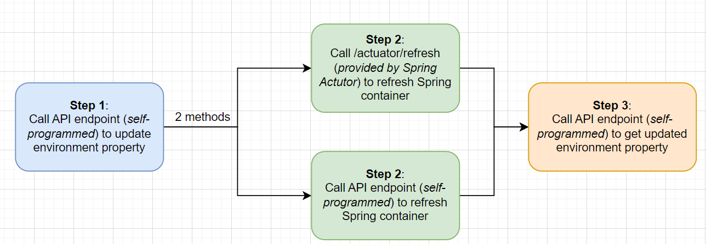

# Spring - reloading configuration
## Question

How to dynamically refresh configuration without rebooting Spring application ("hot loading") ?

## Solutions

### 1. Create custom API endpoint or scheduler (定时任务)

优点：无需其他maven依赖

缺点：需要程序员手动实现逻辑（包括更新配置、更新对应的Bean）

### 2. 【推荐】Spring Cloud `@RefreshScope` and `/refresh` actuator

这种方式实际上和第一种方式一样，但是借助了 Spring 框架提供的工具，无需程序员手动实现逻辑

> 参考：[Changing Spring Boot Properties at Runtime | Baeldung](https://www.baeldung.com/spring-boot-properties-dynamic-update)

#### 程序逻辑展示

#### @RefreshScope 注解的作用是什么？

`@RefreshScope` 作用在 Bean上，为其创建了一个代理对象

> When we apply the *@RefreshScope* annotation to a bean, Spring Boot doesn’t instantiate the bean directly, as it normally would. Instead, **it creates a proxy object that acts as a placeholder or delegate for the actual bean**.

### 3. Database or External Config Server (e.g. Nacos)

* Nacos + Spring Cloud 官方示例：[Nacos 融合 Spring Cloud，成为注册配置中心](https://nacos.io/zh-cn/docs/v2/ecology/use-nacos-with-spring-cloud.html)
  * 使用Nacos，也是需要在自己的 Java 程序中加上 `@RefreshScope` 注解的

### 4. 借助 Spring Event

