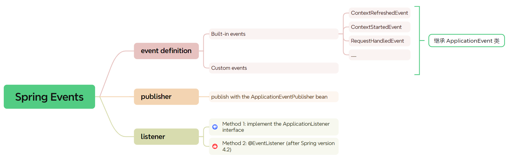
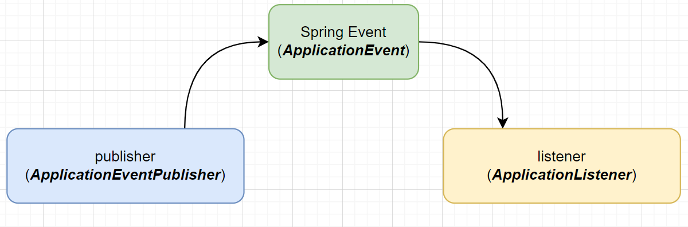

# Spring Event

### What is Spring Event?

> Spring has an eventing mechanism which is built around the *ApplicationContext.* It can be used to **exchange information between different beans.** We can make use of application events by listening for events and executing custom code.


### Summary




### Logic




### Demo: custom `EventListener` for `ContextStartedEvent` 

synchronously:

```java
@Component
public class AnnotationDrivenEventListener {
    @EventListener
    public void handleContextStart(ContextStartedEvent cse) {
        System.out.println("Handling context started event.");
    }
}
```

asynchronously (simply by adding `@Async` and `@EnableAsync`):

```java
@Component
public class AnnotationDrivenEventListener {
    @EventListener
    @Async
    public void handleContextStart(ContextStartedEvent cse) {
        System.out.println("Handling context started event.");
    }
}
```


### Ref

* [Spring Events | Baeldung](https://www.baeldung.com/spring-events)
* [Spring Application Context Events | Baeldung](https://www.baeldung.com/spring-context-events)