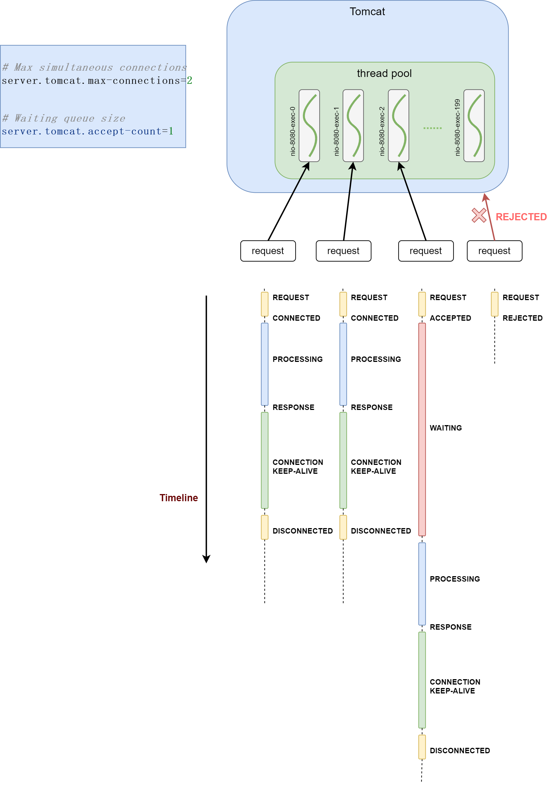

# Tomcat

### Common configuration parameters

[Common Application Properties :: Spring Boot](https://docs.spring.io/spring-boot/appendix/application-properties/index.html)

(Search for `server.tomcat`)

### When concurrent requests hit Tomcat...

* 1st and 2nd requests are accepted, and immediately be handled
* 3rd request is accepted, but NOT immediately be handled (`max-connections` is reached)
* 4th request is rejected (`accept-count` is reached) 

### Code example

* Run automatic test for testing concurrent requests: `DemoApplicationTests`

### Ref

* [Embedded Web Servers :: Spring Boot](https://docs.spring.io/spring-boot/how-to/webserver.html)