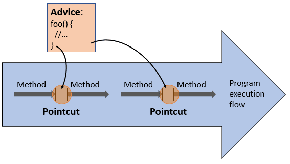

# Spring AOP

> **Dependency injection** and **AOP** are two main design concepts of Spring framework.


## Problem: cross-cutting concern

1. Use logging procedures in individual classes. The problem is **scattering** (code duplication) and **tangling** (significant dependencies between systems).


2. Abstract out a common utility class `Logger`. The scattering problem is solved, but still high dependency between A/B/C with the `Logger` class (tangling), as shown in red. A/B/C will need to call the `logMessage()` function inside `Logger`.


3. Using aspects. **Aspects** are special classes for cross-cutting concerns. **Aspect configuration** tells which object methods these aspects should apply to. Therefore, instead of calling the logger from A/B/C, the aspect now takes care of the logging method to be applied before (and/or after) the configured target A/B/C methods. This is achieved by wrapping logics around the target methods and implemented by Spring.


This solution to this problem is **aspect-oriented programming (AOP)**, allows behaviors that are not central to the business logic (such as logging) to be added to a program without cluttering the code core to the functionality.


## Concepts

**Aspect**: An aspect is a modularization of a concern that cuts across multiple classes. Unified logging can be an example of such cross-cutting concern.

**Join point**: a point during the execution of a program, such as the execution of a method or the handling of an exception. <u>In Spring AOP</u>, a join point always represents a **method execution**.

**Advice**: an action taken by an aspect at a particular *Join point*. Different types of advice include *“around,” “before,”* and *“after.”* In Spring, an *Advice* is modelled as an interceptor, maintaining a chain of interceptors around the *Join point*.

**Pointcut**: a **predicate** that helps **match** an *Advice* to be applied by an *Aspect* at a particular *Join Point*




> In computing, **aspect-oriented programming (AOP)** is a programming paradigm that aims to increase modularity by allowing the separation of cross-cutting concerns. It does so by adding behavior to existing code (an **advice**) without modifying the code itself, instead separately specifying which code is modified via a "**pointcut**" specification, such as "log all function calls when the function's name begins with 'set'". This allows behaviors that are not central to the business logic (such as logging) to be added to a program without cluttering the code core to the functionality.
>
> 
>
> An **aspect** can alter the behavior of the base code (the non-aspect part of a program) by applying **advice** (additional behavior) at various **join points** (points in a program) specified in a quantification or query called a **pointcut** (that detects whether a given join point matches)
>
> *(From Wikipedia)*


With these above-mentioned concepts, AOP performs **weaving** to link aspects with base program (at compile/load/run time). If weaving is performed at compile time, this is called **static AOP**; otherwise it's called **dynamic AOP**.


## Annotation-based configuration

Annotation-based configuration uses `AspectJ` style for AOP. 

> Spring interprets the same annotations as AspectJ 5, using a library supplied by AspectJ for pointcut parsing and matching. The AOP runtime is still pure Spring AOP, though, and there is **no** dependency on the AspectJ compiler or weaver.


#### Pointcut expression

>  (see: https://docs.spring.io/spring-framework/reference/core/aop/ataspectj/pointcuts.html#aop-pointcuts-designators)
>
> Spring AOP supports the following AspectJ **pointcut designators (PCD)** for use in pointcut expressions:
>
> - `execution`: For matching method execution join points. This is the primary pointcut designator to use when working with Spring AOP.
> - `within`: Limits matching to join points within certain types (the execution of a method declared within a matching type when using Spring AOP).
> - `this`: Limits matching to join points (the execution of methods when using Spring AOP) where the bean reference (Spring AOP proxy) is an instance of the given type.
> - `target`: Limits matching to join points (the execution of methods when using Spring AOP) where the target object (application object being proxied) is an instance of the given type.
> - `args`: Limits matching to join points (the execution of methods when using Spring AOP) where the arguments are instances of the given types.
> - `@target`: Limits matching to join points (the execution of methods when using Spring AOP) where the class of the executing object has an annotation of the given type.
> - `@args`: Limits matching to join points (the execution of methods when using Spring AOP) where the runtime type of the actual arguments passed have annotations of the given types.
> - `@within`: Limits matching to join points within types that have the given annotation (the execution of methods declared in types with the given annotation when using Spring AOP).
> - `@annotation`: Limits matching to join points where the subject of the join point (the method being run in Spring AOP) has the given annotation.


**See more in demo (package `com.example.annotation_demo`).**


## Schema-based configuration

> Ref: https://docs.spring.io/spring-framework/reference/core/aop/schema.html

Schema-based configuration is **XML-based**. Below is an example containing two aspects:

```xml

<beans xmlns="http://www.springframework.org/schema/beans"
       xmlns:xsi="http://www.w3.org/2001/XMLSchema-instance"
       xmlns:aop="http://www.springframework.org/schema/aop"
       xsi:schemaLocation="http://www.springframework.org/schema/aop http://www.springframework.org/schema/aop/spring-aop-3.2.xsd http://www.springframework.org/schema/beans http://www.springframework.org/schema/beans/spring-beans-3.2.xsd">

   <bean id="adder" class="com.example.XML_demo.Adder"/>
   <bean id="beverage" class="com.example.XML_demo.Beverage"/>

   <!--  Define Aspect beans  -->
   <bean id="loggingAspectBean" class="com.example.XML_demo.LoggingAspect"/>
   <bean id="validationAspectBean" class="com.example.XML_demo.ValidationAspect"/>

   <aop:config>
      <!-- Aspect for logging before and after every method in adder -->
      <aop:aspect id="loggingAspect" ref="loggingAspectBean">
         <!-- NON-shared pointcut, only used by loggingAspect -->
         <aop:pointcut id="pointCutForEveryMethod" expression="execution(* com.example.XML_demo.Adder+.*(..))"/>

         <aop:before method="logBeforeAdvice" pointcut-ref="pointCutForEveryMethod"/>
         <aop:after method="logAfterAdvice" pointcut-ref="pointCutForEveryMethod"/>
         <aop:after-returning method="logAfterReturnAdvice" returning="returnValue"
                              pointcut-ref="pointCutForEveryMethod"/>
      </aop:aspect>

      <!-- Aspect for input validation for set* methods -->
      <aop:aspect id="validationAspect" ref="validationAspectBean">
         <!-- NON-shared pointcut, only used by validationAspect -->
         <aop:pointcut id="pointCutForSetMethods"
                       expression="execution(* set*(..)) and args(passedInValue)"/>  <!-- passedInValue is the argument when invoking set* method -->

         <aop:before method="validateSetValueBeforeAdvice" arg-names="passedInValue"
                     pointcut-ref="pointCutForSetMethods"/>
      </aop:aspect>
   </aop:config>
</beans>
```

Some key points:

1. **Pointcuts can be shared across multiple aspects**
   * top-level (shared) pointcut vs. inside-aspect (non-shared) pointcut
2. **Writing pointcut expressions**
   * the pointcut expression itself uses the same AspectJ pointcut expression language
   * `execution`, `within`
3. **Binding of advice parameters**
   * `this`, `target`, `args`


**See more in demo (package `com.example.XML_demo`).**


## Under the hood

* The aim of Spring AOP is not to provide the most complete AOP implementation
* The aim is to provide a close integration between AOP implementation and Spring IoC, to help solve common problems in enterprise applications.
* Spring AOP is a **proxy-based** framework (contrary to full-blown frameworks such as AspectJ). Also AspectJ implements static AOP, while Spring AOP is dynamic AOP.


Proxy:

1. JDK dynamic proxies
2. CGLIB


## Ref

* https://en.wikipedia.org/wiki/Aspect-oriented_programming
* https://docs.spring.io/spring-framework/reference/core/aop/introduction-defn.html
* https://docs.spring.io/spring-framework/reference/core/aop/ataspectj/pointcuts.html
* https://www.baeldung.com/spring-aop#introduction
* https://blog.csdn.net/xiaoxian8023/article/details/17258933
* 