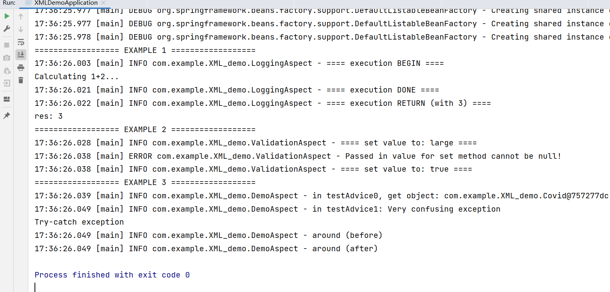

## Introduction

For schema-based Spring AOP, everything is defined inside the XML file (`applicationContext-XML-based-AOP.xml`). In `XMLDemoApplication` there are 3 examples:

1. The `loggingAspect` demonstrates basic before, after, after-returning advices performed on a pointcut for `Adder` class.
2. The `validationAspect` demonstrates a pointcut on `set*` methods. It also accesses to the `passedInValue`.
3. The `demoAspect` demonstrates other three advices (before, after-throwing, around). It also accesses to the `this` object who executed the join point. For around advices, a `ProceedingJoinPoint` (sub-class of `JoinPoint`) can be accessed as context.

## Result

