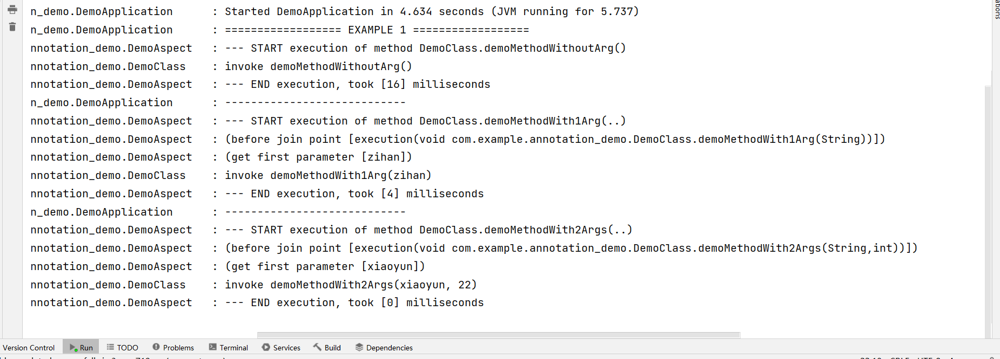

## Introduction

In `DemoAspect` there are two advices:

1. The `doPreLogging` advice (before) accesses the `JoinPoint` context and pass-in parameter `val`. It uses a *named pointcut*. 
2. The `doProfiling` advice (around) provides timing for a method execution. It uses a *inline pointcut*. 

## Result

