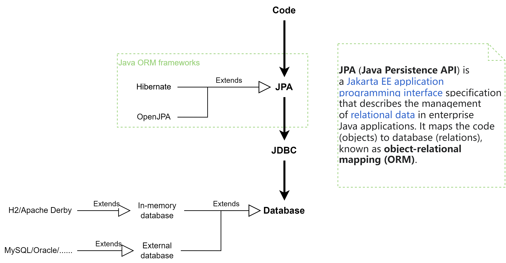

## Spring Boot - Spring Data JPA


### JPA
**JPA** (or its implementation **Hibernate**) is an ORM (object-relational mapping) model for accessing database.  It builds on top of **JDBC** (the plain old way of connecting to DB).




### Spring Data JPA

Spring Data JPA is a wrapper around JPA/Hibernate, providing additional features. Note that Spring Data JPA is **NOT** an implementation of JPA. 


> The goal of the Spring Data repository abstraction is to significantly reduce the amount of boilerplate code required to implement data access layers for various persistence stores.


| references                                                                                                             |
|------------------------------------------------------------------------------------------------------------------------|
| https://docs.spring.io/spring-boot/docs/2.1.x/reference/html/boot-features-sql.html#boot-features-jpa-and-spring-data  |


### Spring Data JPA - basics

#### Entity

**Entities** are normal POJOs representing the "object" of ORM in JPA.

Traditionally, JPA “Entity” classes are specified in a persistence.xml file. With Spring Boot, this file is not necessary and “Entity Scanning” is used instead. Any classes annotated with `@Entity`, `@Embeddable`, or `@MappedSuperclass` are considered.

Other annotations: `@Id`, `@GeneratedValue`, `@Table`, `@OneToMany`, ...


#### Spring Data JPA Repository

Spring Data JPA **repositories** are interfaces that you can define to access data. JPA queries are **created automatically from your method names**. 
For example, a `CityRepository` interface might declare a `findAllByState(String state)` method to find all the cities in a given state.

Spring Data repositories usually extend from the `Repository` or `CrudRepository` interfaces. Example:

```java
// Declaring the interface method name is enough for simple queries!
// The underlying queries are auto-generated by Spring Data JPA.
public interface PersonRepository extends Repository<Person, Long> {

    List<Person> findByEmailAddressAndLastname(EmailAddress emailAddress, String lastname);

    // Enables the distinct flag for the query
    List<Person> findDistinctPeopleByLastnameOrFirstname(String lastname, String firstname);
    List<Person> findPeopleDistinctByLastnameOrFirstname(String lastname, String firstname);

    // Enabling ignoring case for an individual property
    List<Person> findByLastnameIgnoreCase(String lastname);
    // Enabling ignoring case for all suitable properties
    List<Person> findByLastnameAndFirstnameAllIgnoreCase(String lastname, String firstname);

    // Enabling static ORDER BY for a query
    List<Person> findByLastnameOrderByFirstnameAsc(String lastname);
    List<Person> findByLastnameOrderByFirstnameDesc(String lastname);
}
```

| references                                                                                                            |
|-----------------------------------------------------------------------------------------------------------------------|
| https://docs.spring.io/spring-boot/docs/2.1.x/reference/html/boot-features-sql.html#boot-features-jpa-and-spring-data |
| https://spring.io/guides/gs/accessing-data-jpa/                                                                       |
|https://docs.spring.io/spring-data/jpa/docs/current/reference/html/#repositories.query-methods.query-creation|


### Spring Data JPA - `@Query`

For simple queries, using the above-mentioned Spring Data JPA interface methods is enough. But for complex queries, you need to hand-write the query with `@Query`. JPQL or native SQL can be used.

| references                                                                                                             |
|------------------------------------------------------------------------------------------------------------------------|
|https://www.baeldung.com/spring-data-jpa-query|


### Examples
* http://localhost:8443/myapp/employee/findByName?name=zihan
* http://localhost:8443/myapp/employee/findNameContains?str=han
* http://localhost:8443/myapp/employee/findNameContains?str=i
* http://localhost:8443/myapp/employee/findFirstNameEqualsStr?name=ridge
