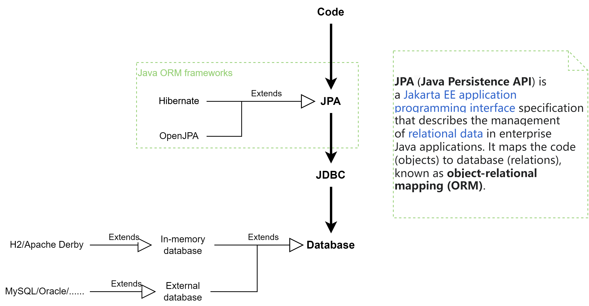

# README
This demo shows how to use `schema.sql` and `data.sql` for database initialization. These two files are stored under the `resource` directory and will be simply executed in sequence during Spring server start-up by **JPA/Hibernate**. However, the error-prone part is the configurations inside `application.properties` file.

### Demo 1: In-memory database (H2)

### Demo 2: MySQL
Relevant configuration parameters can be found inside class `org.springframework.boot.autoconfigure.sql.init.SqlInitializationProperties`

---
### Extension 1: JPA vs. Hibernate
JPA is a **specification**. Hibernate is an **implementation** of JPA. (JPA is an abstract class, Hibernate is its concrete subclass.) Note that implementations such as Hibernate also provides additional features compared with JPA. (see: https://stackoverflow.com/a/4477349)

### Extension 2: JPA/Hibernate vs. MyBatis

> The way I tend to look at it is this: Hibernate works better if your view is more object-centric. If however you view is more database-centric then iBATIS/MyBatis is a much stronger choice.
> 
> *src: https://stackoverflow.com/questions/1984548/hibernate-vs-ibatis*

So these are just two ways of **doing the same thing - accessing the database**.
* `JPA` is **ORM** framework, more **code-oriented**. (from code (`Entity`) to DB)
* `MyBatis` is **SQL mapper** framework, more **DB/SQL-oriented**. (from DB (schema) to code (`mapper.xml`))

(ref: https://zhuanlan.zhihu.com/p/263043522)

(ref: https://cloud.tencent.com/developer/article/1594337)

> 选择 Spring Data JPA 的核心原因有以下几点：
>
> - 从根本上来说是开发模式的转变，新项目不用事先就设计好完整的数据库和表结构，开发过程中自动生成[数据库表](https://www.zhihu.com/search?q=数据库表&search_source=Entity&hybrid_search_source=Entity&hybrid_search_extra={"sourceType"%3A"answer"%2C"sourceId"%3A1678408561})结构，可以快速开发和迭代，逐渐完善。
>
> - 在企业级项目中，能享受到跨数据库类型的好处，能屏蔽底层数据库的一些 SQL 差异。不同地区的客户可能会要求指定使用某种特定的数据库，也就几乎没有多少改造的成本了。
>
> - 持久层的代码量更少，维护起来更加简单，后续新增、修改字段时，大多数时候只需要维护 Java Entity 的[注解映射](https://www.zhihu.com/search?q=注解映射&search_source=Entity&hybrid_search_source=Entity&hybrid_search_extra={"sourceType"%3A"answer"%2C"sourceId"%3A1678408561})关系就行了。
>
> Spring Data JPA 的缺点：
>
> * Spring Data JPA 的不便于写复杂动态 SQL 的问题（可通过使用 JPQL/原生SQL解决）
> * 复杂性高。因为其基于 Hibernate，封装度很高，学习成本也自然更高。而且相关的资料比 `MyBatis` 而言也少很多，`MyBatis` 可是从很早就是有官方中文文档的，而 Spring Data JPA 的官方文档介绍的内容太简单，只能应对一些简单的业务场景，复杂场景、高级功能介绍太少。这也劝退了不少的人。所以，我经常能听到一些初学者问，JPA 中能不能写[多表查询](https://www.zhihu.com/search?q=多表查询&search_source=Entity&hybrid_search_source=Entity&hybrid_search_extra={"sourceType"%3A"answer"%2C"sourceId"%3A1678408561})之类的问题。
> * 由于不是直接执行SQL（在数据库和Java代码间增加了一层ORM），所以支持的数据库类型不完备（如 `OceanBase`）。而 `MyBatis` 完全就是执行SQL，所以兼容所有的关系型DB。
>
>   
>
> Ref: https://www.zhihu.com/question/316458408/answer/1678408561

### Extension 3: JPA/Hibernate vs. JDBC

JDBC is **a plain old way** of accessing the database with raw SQL queries. JPA/Hibernate uses JDBC under the hood (as also shown in the above diagram).

### Extension 4: Spring profile

https://www.baeldung.com/spring-profiles

### Extension 5

Script-based initialization vs. Hibernate initialization

* script-based initialization: through schema.sql and data.sql
* Hibernate initialization: through JPA @Entity classes.
* See more: https://docs.spring.io/spring-boot/docs/current/reference/html/howto.html#howto.data-initialization

