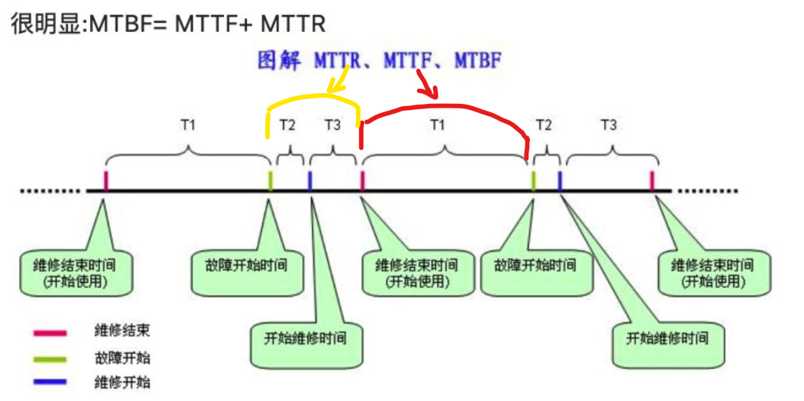

# 笔记

> * 高级架构师侧重于《软件工程》
>
> * 中级设计师注重《操作系统》、《数据结构与算法》、《数据库》、《计算机网络》、《设计模式》

## 教材

1. 疑问：**3.1.6信息系统开发方法** vs. **5.1.2软件过程模型**

## MCQ

###### 软件工程

* 模型（瀑布、敏捷）
* Legacy system（四个象限；集成技术 vs. 继承业务）
  * [系统架构设计师-遗留系统-CSDN博客](https://blog.csdn.net/ce123_zhouwei/article/details/109611108)

###### 操作系统

* 磁盘调度算法（SSTF/SCAN/CSCAN）

###### 系统架构

* 软件可靠性（**8.1 软件系统质量属性**）

  * 指标：可靠度、MTTF、MTTR、MTBF

  * MTTF + MTTR = MTBF 

    

  * 在失效率为常数和修复时间（MTTR）很短的情况下， MTTF 和 MTBF几乎相等

  * [MTTR、MTBF、MTTF、可用性、可靠性傻傻分不清楚？-CSDN博客](https://blog.csdn.net/yunhua_lee/article/details/121674703)

  * 可靠性 vs. 可用性：可靠性是个广义的宏观概念，包含多个指标（如MTTF）；可用性是一个单一指标，狭义上只定义为系统在一定时间内正常工作的时间所占比例。

* 嵌入式系统

* 机器学习系统

  * 硬件：GPU
  * 软件：机器学习算法

###### 四大件

* 数据库
  * 三层模式
  * 3NF
  * 关系代数（如笛卡尔积、条件连接、自然连接、等值连接）
    * [SQL连接的理解和使用（内连接：自然连接&等值连接，外连接：左连接&右连接&全外连接）_sql自然连接-CSDN博客](https://blog.csdn.net/qq_41592346/article/details/129874625)
* OS
* 计算机网络
* 数据结构和算法

###### 测试

* 黑盒测试
* 白盒测试（语句覆盖、判断覆盖、条件覆盖、路径覆盖）
  * [详解软件测试中白盒测试基本概念及四种白盒测试方法以及六种逻辑覆盖法（语句覆盖、判定覆盖、条件覆盖、判定条件覆盖、条件组合覆盖、路径覆盖）-CSDN博客](https://blog.csdn.net/qq_42944594/article/details/121907540)

* McCabe

###### 安全

* 特性：保密性（C）、完整性（I）、可用性（A）、可控性与可审查性
* 加密算法
* 数字签名

## QA

软件工程

* 质量属性效用树(utility tree)

* 架构风格（解释器/管道过滤器/隐式调用）
* 需求分析 & UML
* 数据驱动方法

系统设计

* 数据库设计 / E-R图 / 数据流图
* Redis 缓存（数据一致性 / 分布式节点 / 缓存击穿）
* 布隆过滤器
* 网络协议的选择（TCP vs. UDP）

## Essay